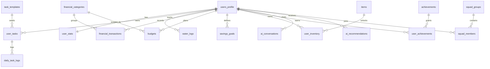

# PRD - LEVEL UP DEEN

## Metadata Dokumen
- **Nama Produk:** Level Up Deen
- **Jenis Produk:** Progressive Web App (PWA)
- **Versi PRD:** 1.1 (Revisi Peningkatan)
- **Versi Produk Target:** 1.0 (MVP Personal Use)
- **Tahun:** 2026
- **Pemilik Produk:** Product Team Level Up Deen
- **Status Dokumen:** Final Draft untuk eksekusi MVP + rencana v1.1

## Riwayat Revisi
- **v1.0:** Draft PRD awal MVP.
- **v1.1:** Penambahan persona detail, KPI operasional, edge case & error handling, social retention lite, dan AI feature blueprint.

---

## 1. Ringkasan Eksekutif
Level Up Deen adalah platform pengembangan diri harian berbasis gamifikasi Islami untuk mahasiswa dan muslim produktif. Produk ini menggabungkan pilar **Deen, Body, Mind, Wealth,** dan **Discipline** agar pengguna dapat membangun kebiasaan baik secara bertahap, terukur, dan menyenangkan.

Berbeda dari habit tracker umum, aplikasi ini menerapkan sistem RPG-like progression: **daily quest, EXP, level, rank, coin, streak, achievement, avatar, item shop,** dan **personalization engine**. Tujuan utama MVP adalah membuat pengguna konsisten menjalankan kebiasaan inti dengan beban awal realistis.

Nilai inti produk:
- Membantu konsistensi ibadah wajib dan sunnah.
- Mengintegrasikan tracking spiritual, fisik, dan finansial dalam satu aplikasi.
- Menyediakan pengalaman visual dark fantasy yang meningkatkan engagement.
- Menjaga motivasi dengan reward dan progres, bukan tekanan.

---

## 2. Latar Belakang & Problem Statement
Pengguna target umumnya ingin memperbaiki diri, tetapi gagal konsisten karena tidak memiliki sistem harian yang ringan dan menyatu.

### 2.1 Masalah Utama
- Target awal sering terlalu berat sehingga pengguna cepat drop.
- Aktivitas ibadah, olahraga, belajar, dan keuangan tersebar di banyak aplikasi.
- Habit tracker konvensional terasa datar, minim emosi/progres.
- Banyak aplikasi produktivitas tidak membawa konteks Islami secara natural.
- Data finansial sering berdiri sendiri, tidak terkait kebiasaan harian.
- Aktivitas sunnah dan personal growth membutuhkan fleksibilitas custom task.

### 2.2 Hipotesis Produk
Jika pengguna mendapatkan target awal yang personal, reward progres yang jelas, serta dashboard menyatu untuk aktivitas harian, maka retensi dan konsistensi harian akan meningkat signifikan dalam 30 hari pertama.

---

## 3. Tujuan, Sasaran, dan Ruang Lingkup

## 3.1 Tujuan Produk
- Menyediakan platform pengembangan diri harian bernilai Islami.
- Menjadikan shalat 5 waktu sebagai quest wajib permanen.
- Mendorong kebiasaan sunnah, olahraga, hidrasi, dan disiplin finansial.
- Memberikan motivasi berkelanjutan melalui sistem gamifikasi.
- Menyiapkan fondasi teknis untuk fitur sosial di fase lanjutan.

## 3.2 Sasaran MVP (Versi 1.0)
- Registrasi/login + onboarding personalisasi.
- Daily quest + self-check completion.
- EXP, level, rank, coin, streak, achievement dasar.
- Habit tracker Islami + fitness + water tracker.
- Finance tracker harian + budget planning + savings goal.
- Dashboard progres personal.
- PWA responsif mobile-first.

## 3.3 Di Luar Ruang Lingkup MVP
- Leaderboard publik.
- Guild/party dan challenge komunitas.
- Integrasi Strava/Google Fit/wearables.
- Validasi foto aktivitas.
- Native mobile app Android/iOS.
- Marketplace item kompleks.

Catatan versi:
- **v1.0:** AI dan social feature belum menjadi komponen wajib rilis.
- **v1.1 (opsional bertahap):** Social retention lite dan AI assistive feature mulai diaktifkan secara terbatas (beta rollout).

---

## 4. Prinsip Produk
1. **Tidak memberatkan user baru:** target awal harus realistis.
2. **Shalat wajib permanen:** tidak bisa dihapus user.
3. **Sunnah fleksibel:** dapat ditambah, diubah, dijadwalkan, dinonaktifkan.
4. **Gamifikasi untuk motivasi:** bukan sumber tekanan/penalti berlebihan.
5. **Progress over perfection:** progres kecil tetap dihargai.
6. **Visual dark fantasy, substansi Islami:** estetika kuat, narasi tetap selaras nilai Islam.

---

## 5. Persona Pengguna

## 5.1 Persona Primer A - "Pelajar yang Sibuk"
| Atribut | Detail |
|---|---|
| Usia | 18-24 |
| Aktivitas utama | Kuliah, organisasi, tugas, kadang kerja part-time |
| Pain point | Jadwal padat membuat ibadah sunnah dan olahraga sering terlewat |
| Kebutuhan utama | Quest ringan, checklist cepat, pengingat waktu shalat, progres yang terasa |
| Modul paling relevan | Daily Quest, Deen Tracker, Water Tracker, Mind, Discipline |
| Sinyal sukses | Prayer streak stabil >= 7 hari dan completion rate naik mingguan |

## 5.2 Persona Primer B - "Pekerja Kantoran"
| Atribut | Detail |
|---|---|
| Usia | 23-32 |
| Aktivitas utama | Bekerja full-time, commuting, tanggung jawab rumah |
| Pain point | Sulit menjaga konsistensi ibadah sunnah, olahraga, dan kontrol pengeluaran |
| Kebutuhan utama | Integrasi habit + finance dalam satu dashboard, auto-summary mingguan |
| Modul paling relevan | Deen Tracker, Fitness Tracker, Finance Tracker, Budget Planning |
| Sinyal sukses | Transaksi tercatat rutin, budget warning menurun, streak tetap terjaga |

## 5.3 Persona Sekunder - "Muslim Produktif Mandiri"
| Atribut | Detail |
|---|---|
| Usia | 20-35 |
| Aktivitas utama | Belajar mandiri, proyek personal, kerja fleksibel |
| Pain point | Terlalu banyak tools terpisah, cepat bosan dengan tracker biasa |
| Kebutuhan utama | Gamifikasi kuat, avatar progression, custom quest fleksibel |
| Modul paling relevan | Gamification, Avatar Shop, Custom Task, Dashboard |
| Sinyal sukses | Daily active usage stabil, item progression konsisten |

## 5.4 Jobs To Be Done (JTBD)
- "Bantu saya konsisten ibadah dan kebiasaan baik tanpa merasa terbebani."
- "Gabungkan tracking ibadah, fitness, dan keuangan dalam satu tempat."
- "Beri saya rasa progres yang jelas setiap hari."
- "Saat saya mulai turun performa, bantu saya kembali ke jalur dengan target mikro."

---

## 6. KPI & Metrik Keberhasilan

## 6.1 KPI Produk MVP
- **DAU (Daily Active Users):** baseline target awal 500 user aktif harian setelah fase beta.
- **D7 Retention:** >= 35%
- **D30 Retention:** >= 20%
- **Onboarding Completion Rate:** >= 70%
- **Daily Active Completion (minimal mandatory quest):** >= 45%
- **Average Weekly Active Days per User:** >= 4 hari/minggu
- **Finance Log Adoption (user yang input transaksi >= 3 kali/minggu):** >= 30%

## 6.2 Metrik Perilaku
- % user dengan prayer streak >= 7 hari.
- Rata-rata quest selesai per hari.
- Rata-rata water target completion rate per minggu.
- % user yang menetapkan budget dan savings goal.
- Rata-rata jumlah transaksi finance tercatat per user per minggu.
- % user yang menerima lalu menindaklanjuti recovery quest.

## 6.3 North Star Metric
- **Meaningful Daily Completion Rate (MDCR):** persentase user harian yang menyelesaikan minimal 1 mandatory quest + 1 quest pengembangan lain (deen/fitness/mind/wealth) dalam hari yang sama.

## 6.4 Instrumentasi & Evaluasi
- Seluruh event utama wajib di-track: `onboarding_completed`, `quest_completed`, `streak_updated`, `level_up`, `transaction_logged`, `budget_warning_shown`, `item_purchased`.
- Semua KPI dilihat dalam 3 jendela: 7 hari, 30 hari, dan 90 hari.
- Evaluasi produk dilakukan minimal 2 minggu sekali selama beta.

---

## 7. Konsep Produk & Pilar

## 7.1 Deen
- Shalat 5 waktu (mandatory).
- Tilawah, sedekah, dzikir, dhuha, tahajud, hafalan, custom sunnah.

## 7.2 Body
- Lari/jalan, push up, pull up, squat, custom workout.

## 7.3 Mind
- Membaca buku, belajar skill, refleksi/jurnal, target belajar.

## 7.4 Wealth
- Pencatatan income/expense, kategori, budget, savings goal, cashflow.

## 7.5 Discipline
- Streak, completion rate mingguan/bulanan, recovery path saat gagal.

---

## 8. Requirement Fungsional (Functional Requirements)

## 8.1 Authentication & User Profile
**User Story:** Sebagai user, saya ingin daftar/login cepat agar bisa mulai onboarding.

**Requirements:**
- FR-AUTH-01: Register via email/password.
- FR-AUTH-02: Login via email/password.
- FR-AUTH-03: Login via Google OAuth.
- FR-AUTH-04: Simpan profil dasar (username unik, nama, timezone, avatar awal).
- FR-AUTH-05: Simpan flag `onboarding_completed`.

**Acceptance Criteria:**
- User bisa login ulang dan data profil tetap konsisten.
- Username harus unik.
- Timezone tersimpan dan dipakai untuk log harian.

## 8.2 Onboarding & Personalization Engine
**User Story:** Sebagai user baru, saya ingin target awal sesuai kondisi saya.

**Requirements:**
- FR-ONB-01: Multi-step onboarding (profil, spiritual, fisik, air minum, finansial).
- FR-ONB-02: Hasil onboarding menghasilkan default task + target awal.
- FR-ONB-03: Sistem memberi rekomendasi reminder time.
- FR-ONB-04: User tetap bisa edit target setelah onboarding.

**Acceptance Criteria:**
- Setelah onboarding selesai, dashboard menampilkan quest harian yang relevan.
- Mandatory prayer quest otomatis aktif dan non-deletable.

## 8.3 Daily Quest System
**User Story:** Sebagai user, saya ingin daftar quest harian yang jelas dan mudah dicentang.

**Requirements:**
- FR-DQ-01: Tampilkan quest berdasarkan kategori (mandatory/recommended/custom/bonus).
- FR-DQ-02: Self-check completion per task.
- FR-DQ-03: Input actual value untuk task numerik (reps/km/ml/page/ayat/rupiah).
- FR-DQ-04: Hitung EXP/coin saat task selesai.
- FR-DQ-05: Tombol complete all eligible tasks.

**Acceptance Criteria:**
- Status task tersimpan per tanggal (`log_date`).
- Task selesai menambah EXP secara real-time di UI.

## 8.4 Deen Tracker
- FR-DEEN-01: Checklist shalat 5 waktu.
- FR-DEEN-02: Tracking tilawah/sedekah/dzikir/dhuha/tahajud/hafalan.
- FR-DEEN-03: Custom sunnah task CRUD.
- FR-DEEN-04: Prayer streak dan spiritual dashboard.
- FR-DEEN-05: Shalat 5 waktu tidak dapat dihapus (`is_deletable=false`).

## 8.5 Fitness Tracker
- FR-FIT-01: Input lari berdasarkan jarak/durasi.
- FR-FIT-02: Input push up/pull up/squat berdasarkan repetisi.
- FR-FIT-03: Custom workout.
- FR-FIT-04: Progress chart mingguan.
- FR-FIT-05: Reward EXP berbasis effort.

## 8.6 Water Tracker
- FR-WATER-01: Target hidrasi harian (ml/gelas).
- FR-WATER-02: Quick add 250/500/750 ml.
- FR-WATER-03: Progress bar/circular progress.
- FR-WATER-04: Reminder minum.
- FR-WATER-05: EXP kecil saat target harian tercapai.

## 8.7 Finance Tracker
- FR-FIN-01: Input transaksi harian (income/expense).
- FR-FIN-02: Kategori transaksi custom + default.
- FR-FIN-03: Riwayat dan filter transaksi.
- FR-FIN-04: Ringkasan total harian dan bulanan.
- FR-FIN-05: Integrasi ke budget warning dan savings progress.

## 8.8 Finance Planning
- FR-PLAN-01: Budget per kategori per bulan.
- FR-PLAN-02: Alert threshold jika mendekati/melebihi budget.
- FR-PLAN-03: Savings goal (nama target, nominal, target date).
- FR-PLAN-04: Cashflow dashboard income vs expense.
- FR-PLAN-05: Laporan bulanan per kategori.

## 8.9 Gamification Engine
- FR-GAME-01: Kalkulasi EXP, coin, level up otomatis.
- FR-GAME-02: Rank mapping berdasarkan level.
- FR-GAME-03: Streak harian dan mingguan.
- FR-GAME-04: Achievement unlock logic.
- FR-GAME-05: Penalty ringan + recovery quest.

## 8.10 Avatar, Shop, Inventory
- FR-AVA-01: Avatar dark fantasy dengan item kosmetik.
- FR-AVA-02: Item shop (skin, aura, frame, title, badge).
- FR-AVA-03: Purchase item dengan validasi coin + unlock level.
- FR-AVA-04: Inventory dan equip/unequip item.
- FR-AVA-05: Item unlock via level atau coin.

## 8.11 Dashboard Utama
- FR-DB-01: Tampilkan avatar, level, rank, EXP bar, coin.
- FR-DB-02: Daily progress + streak counters.
- FR-DB-03: Quick stats deen/fitness/water/finance.
- FR-DB-04: Budget warning card.
- FR-DB-05: Savings goal card + activity feed.

## 8.12 Settings
- FR-SET-01: Edit profil dan reminder.
- FR-SET-02: Edit target harian.
- FR-SET-03: Kelola custom tasks.
- FR-SET-04: Kelola kategori keuangan.
- FR-SET-05: Export data + delete account.

## 8.13 Social Retention Lite (Opsional v1.1)
- FR-SOC-01: Mini leaderboard berdasarkan completion score mingguan (bukan leaderboard nilai ibadah wajib).
- FR-SOC-02: Squad kecil (2-5 user) untuk fitur saling mengingatkan dan memberi dukungan.
- FR-SOC-03: Opsi privasi granular untuk menyembunyikan metrik sensitif (terutama finance).
- FR-SOC-04: Aktivitas sosial hanya menampilkan indikator progres umum (mis. "quest selesai"), tidak menampilkan detail ibadah wajib per waktu.
- FR-SOC-05: Push reminder berbasis squad hanya aktif jika user opt-in.

## 8.14 AI Feature Set (Opsional v1.1/v1.2)

## 8.14.1 AI Deen & Life Coach
- FR-AI-COACH-01: Chat assistant kontekstual pada dashboard/tab konsultasi.
- FR-AI-COACH-02: Assistant dapat memberi motivasi, refleksi, dan saran manajemen waktu berbasis data user.
- FR-AI-COACH-03: Assistant menampilkan disclaimer bahwa saran bersifat pendamping, bukan fatwa.

## 8.14.2 Smart Quest Personalization
- FR-AI-QUEST-01: Deteksi quest yang sering gagal dalam 7 hari terakhir.
- FR-AI-QUEST-02: Rekomendasi micro-habit otomatis untuk recovery (contoh: target lebih kecil sementara).
- FR-AI-QUEST-03: User dapat menerima, menunda, atau menolak rekomendasi AI.

## 8.14.3 AI Finance Insight & Categorization
- FR-AI-FIN-01: Input bahasa natural (contoh: "Beli makan siang 50rb") diparse otomatis jadi transaksi.
- FR-AI-FIN-02: Prediksi kategori transaksi berdasarkan histori pengguna.
- FR-AI-FIN-03: Saran ringkas kebiasaan belanja mingguan dengan nada suportif.

## 8.14.4 Intelligent Goal Forecasting
- FR-AI-GOAL-01: Prediksi estimasi tanggal tercapai untuk savings goal.
- FR-AI-GOAL-02: Alert risiko target meleset berdasarkan tren 2-4 minggu terbaru.
- FR-AI-GOAL-03: Simulasi "jika-kalau" sederhana (mis. kurangi pengeluaran kategori tertentu).

## 8.14.5 Dynamic Avatar Evolution (Eksperimental v1.2)
- FR-AI-AVA-01: Avatar aura/effect adaptif berdasarkan pilar progres dominan.
- FR-AI-AVA-02: Evolusi bersifat kosmetik dan tidak mempengaruhi skor ibadah.
- FR-AI-AVA-03: User bisa mematikan efek dinamis dari settings.

---

## 9. Requirement Non-Fungsional (NFR)
- NFR-01: Aplikasi responsif mobile-first (>= 360px width).
- NFR-02: PWA installable (manifest + service worker).
- NFR-03: Time-to-interactive dashboard <= 3 detik pada koneksi 4G stabil.
- NFR-04: Ketersediaan layanan target >= 99.5% (mengikuti SLA platform).
- NFR-05: Seluruh data user diproteksi RLS berdasarkan `user_id`.
- NFR-06: Data finansial user bersifat privat dan tidak tampil di leaderboard.
- NFR-07: Audit log event penting (login, transaksi, pembelian item, level-up).
- NFR-08: Arsitektur modular untuk ekspansi komunitas di versi lanjut.
- NFR-09: Mendukung mode offline terbatas untuk checklist dan input transaksi ringan (client-side queue).
- NFR-10: Sinkronisasi ulang otomatis saat koneksi kembali, dengan mekanisme conflict resolution berbasis timestamp.
- NFR-11: P95 latency endpoint inti <= 800ms (di luar cold start).
- NFR-12: Fitur AI wajib melalui safety filter, logging, dan fallback non-AI jika model gagal.

---

## 10. Sistem Gamifikasi (Detail)

## 10.1 EXP
Contoh bobot awal:

| Task | EXP |
|---|---:|
| Shalat Subuh | 20 |
| Shalat Dzuhur | 20 |
| Shalat Ashar | 20 |
| Shalat Maghrib | 20 |
| Shalat Isya | 20 |
| Tilawah harian | 30 |
| Sedekah harian | 25 |
| Dzikir pagi | 15 |
| Dzikir petang | 15 |
| Shalat dhuha | 25 |
| Shalat tahajud | 50 |
| Hafalan tambahan | 35 |
| Membaca buku | 25 |
| Push up | 20 |
| Pull up | 25 |
| Squat | 20 |
| Lari | 40 |
| Target air minum tercapai | 15 |
| Catat pengeluaran harian | 15 |
| Tidak melebihi budget harian | 20 |

## 10.2 Coin
Sumber coin:
- Complete 5 mandatory prayers.
- Complete full daily quest.
- Milestone streak (3/7/14/30 hari).
- Weekly challenge selesai.
- Target tabungan tercapai.
- Budget bulanan tetap aman.

Contoh reward:

| Achievement | Coin |
|---|---:|
| Complete 5 daily prayers | 10 |
| Complete full daily quest | 25 |
| 7-day streak | 100 |
| Finish weekly fitness challenge | 75 |
| Stay within monthly budget | 150 |
| Reach savings target | 200 |

## 10.3 Leveling Formula
`EXP_next = 100 + (current_level x 50)`

Contoh milestone total EXP minimum:

| Level | Total EXP Minimum |
|---|---:|
| 1 | 0 |
| 2 | 150 |
| 3 | 350 |
| 4 | 600 |
| 5 | 900 |
| 10 | 3,250 |
| 20 | 11,500 |

## 10.4 Rank Mapping

| Rank | Level | Tema |
|---|---|---|
| E-Rank | 1-9 | Awakening |
| D-Rank | 10-19 | Discipline Initiate |
| C-Rank | 20-34 | Consistency Builder |
| B-Rank | 35-49 | Focused Striver |
| A-Rank | 50-74 | High Performer |
| S-Rank | 75-99 | Elite Disciple |
| S+ Rank | 100+ | Master of Discipline |

## 10.5 Penalty & Recovery
- Jika mandatory quest tidak selesai: full quest streak tidak bertambah.
- Jika gagal 2 hari beruntun: munculkan recovery quest.
- Recovery quest mengembalikan motivasi/progres terbatas, tanpa memalsukan data ibadah.

Contoh recovery quest:
- Refleksi 3 menit.
- Rencanakan ulang target besok.
- Kurangi target fisik terlalu berat.
- Tambah reminder aktivitas inti.

## 10.6 Penanganan Error & Edge Cases
- EC-01: Jika user lupa mengisi checklist dalam 1 hari, status default hari itu `pending` sampai cut-off timezone lokal (23:59).
- EC-02: Jika user tidak mengisi >1 hari, status otomatis `skipped` dan sistem menawarkan recovery quest di hari berikutnya.
- EC-03: Mandatory prayer yang tidak diisi tidak boleh di-backfill menjadi "completed" setelah cut-off, kecuali ada mode "catatan keterlambatan" non-EXP.
- EC-04: Saat offline, input disimpan ke local queue; UI menampilkan badge "belum sinkron".
- EC-05: Saat online kembali, sistem melakukan replay queue berurutan berdasarkan `client_timestamp`.
- EC-06: Jika terjadi konflik data (record sama diubah di dua perangkat), aturan default: last-write-wins untuk note/value, tapi log completion immutable setelah tersimpan final.
- EC-07: Jika perhitungan EXP gagal di server, task tetap tersimpan completed dan EXP direkalkulasi lewat background job.

---

## 11. Personalisasi Target (Onboarding)

## 11.1 Input Pertanyaan
- Status user: mahasiswa/pekerja/santri/freelancer/lainnya.
- Tujuan utama: ibadah/fisik/belajar/finansial/semuanya.
- Waktu luang harian realistis.
- Target tilawah, dzikir, dhuha, tahajud, hafalan.
- Kemampuan push up/squat/pull up + target lari.
- Target air minum.
- Preferensi pencatatan pengeluaran + target tabungan.

## 11.2 Output Personalisasi
- Daily quest default.
- Target tilawah, olahraga, dan air minum.
- Kategori finansial awal.
- Budget bulanan awal.
- Savings goal awal.
- EXP multiplier awal (opsional rule-based).
- Rekomendasi reminder.

---

## 12. Arsitektur Sistem & Stack Teknologi

## 12.1 Arsitektur Berlapis
- **Frontend:** Next.js 14 App Router, React, Tailwind CSS, shadcn/ui.
- **Backend:** Next.js API Routes, Server Actions, Supabase Edge Functions.
- **Data Layer:** Supabase PostgreSQL, Supabase Auth, Supabase Storage, Supabase Realtime.
- **Deploy:** Vercel (CI/CD dari GitHub).
- **Visualisasi:** Recharts.
- **Notification:** Web Push Notification.

## 12.2 Integrasi Lanjutan (Post-MVP)
- Google Fit, Strava, payment gateway, modul komunitas.

## 12.3 Arsitektur AI & Personalisasi (v1.1+)
- **AI Gateway Layer:** endpoint terpisah untuk chat, rekomendasi quest, dan parsing finance.
- **Policy Layer:** moderation, prompt guardrail Islami, dan output validator.
- **Feature Store Ringan:** agregasi metrik 7/30 hari untuk memberi konteks ke AI (streak, completion, cashflow trend).
- **Fallback Mode:** jika AI timeout/error, sistem kembali ke rule-based recommendation agar UX tetap stabil.

---

## 13. Skema Data (Supabase PostgreSQL)

## 13.1 Tabel Inti
1. `users_profile`
2. `user_stats`
3. `task_templates`
4. `user_tasks`
5. `daily_task_logs`
6. `water_logs`
7. `financial_categories`
8. `financial_transactions`
9. `budgets`
10. `savings_goals`
11. `items`
12. `user_inventory`
13. `achievements`
14. `user_achievements`
15. `recovery_quest_logs`
16. `sync_queue_logs`
17. `squad_groups` (v1.1)
18. `squad_members` (v1.1)
19. `leaderboard_snapshots` (v1.1)
20. `ai_conversations` (v1.1)
21. `ai_recommendations` (v1.1)
22. `ai_finance_parse_logs` (v1.1)

## 13.2 Prinsip Model Data
- Semua tabel user-specific wajib punya `user_id`.
- `task_templates` menyimpan task sistem bawaan.
- `user_tasks` menyimpan task aktif per user (termasuk custom).
- Log harian dipisah untuk histori dan analitik (`daily_task_logs`, `water_logs`, `financial_transactions`).
- `user_stats` jadi sumber utama status level/rank/coin/streak.

## 13.3 Constraint Kritis
- `username` unik.
- Mandatory prayer task: `is_deletable=false` dan `is_system_required=true`.
- Transaksi finansial wajib punya `type in (income, expense)`.
- RLS policy: read/write hanya untuk pemilik data (`auth.uid() = user_id`).

## 13.4 High-Level Entity Relationship (Preliminary)

## 13.5 Tambahan Skema untuk AI & Sosial
- `ai_conversations`: menyimpan ringkasan percakapan, intent, dan metadata keamanan (bukan data sensitif mentah yang tidak perlu).
- `ai_recommendations`: menyimpan rekomendasi quest/finance, status (`accepted`, `dismissed`, `expired`), dan dampak ke completion.
- `ai_finance_parse_logs`: menyimpan hasil parsing natural language untuk audit dan perbaikan model.
- `squad_groups` dan `squad_members`: struktur grup dukungan kecil dengan aturan opt-in.
- `leaderboard_snapshots`: skor periodik non-finance dan non-detail ibadah wajib untuk menjaga privasi.

---

## 14. Manajemen Pengguna & Akses

## 14.1 Role MVP
- **User:** akses penuh ke data pribadi sendiri.
- **Admin Sistem:** kelola master data (task template, item, achievement, konfigurasi) tanpa mengubah data personal kecuali kebutuhan support terotorisasi.

## 14.2 Security
- Supabase Auth + JWT session.
- RLS di seluruh tabel sensitif.
- Data finansial tidak dipublikasikan.
- Fitur export dan delete account disediakan.
- Data yang dipakai AI dibatasi prinsip minimization (hanya fitur yang relevan).
- Prompt dan respons AI disanitasi dari konten berisiko serta disertai logging audit.

---

## 15. UX Information Architecture & Wireframe Scope

## 15.1 Halaman Inti
1. Landing page.
2. Auth (register/login).
3. Onboarding multi-step.
4. Dashboard utama.
5. Daily Quest page.
6. Deen tracker page.
7. Fitness page.
8. Water tracker page.
9. Finance tracker page.
10. Finance planning page.
11. Avatar & shop page.
12. Settings page.
13. Konsultasi AI (opsional v1.1).
14. Squad & Leaderboard Lite (opsional v1.1).

## 15.2 Prinsip UX
- Mobile-first, cepat, dan minim friksi input.
- Task completion harus 1-2 tap.
- Feedback instan saat EXP/coin bertambah.
- Warning budget tampil jelas tanpa menghakimi.
- Error state jelas dan actionable (contoh: tombol retry saat sync gagal).
- Mode offline harus tetap terasa usable dengan indikator status sinkronisasi.

---

## 16. Alur Pengguna Utama

## 16.1 Registrasi & Onboarding
1. User buka landing.
2. User daftar/login.
3. User isi onboarding.
4. Sistem generate target awal + quest default.
5. User masuk dashboard.

## 16.2 Daily Quest Loop
1. User membuka dashboard/daily quest.
2. User menjalankan aktivitas real-life.
3. User melakukan self-check.
4. Sistem update log, EXP, coin, streak.
5. Jika EXP cukup, user level up.
6. Jika syarat terpenuhi, achievement unlock.

## 16.3 Finance Loop
1. User input transaksi.
2. Sistem update cashflow & budget usage.
3. Jika melewati threshold, tampil warning.
4. Progress savings goal diperbarui.

## 16.4 Item Shop Loop
1. User memperoleh coin dari quest.
2. User pilih item di shop.
3. Sistem validasi coin + unlock level.
4. Item masuk inventory dan bisa di-equip.

## 16.5 Offline-to-Online Sync Loop
1. User menginput checklist/transaction saat offline.
2. Data masuk local queue dengan status `unsynced`.
3. Saat koneksi kembali, queue direplay otomatis ke server.
4. Jika ada konflik, sistem menerapkan aturan conflict resolution dan menampilkan notifikasi hasil sinkronisasi.

## 16.6 AI Smart Quest Loop (Opsional v1.1)
1. Sistem mendeteksi pola quest gagal berulang.
2. AI menghasilkan rekomendasi micro-habit.
3. User memilih accept/dismiss.
4. Jika accept, target harian disesuaikan sementara dan dievaluasi ulang 7 hari.

## 16.7 AI Finance Loop (Opsional v1.1)
1. User mengetik catatan transaksi natural language.
2. AI mem-parse nominal, kategori, dan tipe transaksi.
3. User mengonfirmasi hasil sebelum simpan.
4. Sistem memperbarui cashflow dan prediksi savings goal.

---

## 17. Roadmap Pengembangan

## 17.1 Fase 1 - Fondasi MVP (1-2 bulan)
- Setup Next.js 14 + Supabase + Vercel.
- Auth, profile, onboarding dasar.
- Daily quest + gamification dasar.
- Dashboard utama + PWA setup.

## 17.2 Fase 2 - Habit & Tracker Inti (2-3 bulan)
- Deen tracker, fitness tracker, water tracker.
- Custom task.
- Streak + achievement dasar.
- Reminder dasar.

## 17.3 Fase 3 - Finance Module (1-2 bulan)
- Finance tracker.
- Budget planning.
- Savings goal.
- Laporan bulanan.

## 17.4 Fase 4 - Avatar & Shop (1-2 bulan)
- Avatar dark fantasy.
- Item shop + inventory + equip.
- Rarity dan unlock rule.

## 17.5 Fase 5 - Retention Upgrade (v1.1, 1-2 bulan)
- Social retention lite: squad kecil + mini leaderboard non-sensitif.
- Smart quest personalization (AI assisted).
- AI finance parsing + weekly insight ringkas.
- Forecast savings goal berbasis tren pengeluaran.

## 17.6 Fase 6+ (Lanjutan)
- Komunitas penuh: guild, social challenge skala besar.
- Integrasi Google Fit/Strava.
- AI coach versi lanjut + advanced analytics.
- Dynamic avatar evolution generatif (eksperimental).

---

## 18. Risiko, Batasan, dan Mitigasi

| Risiko | Dampak | Mitigasi |
|---|---|---|
| User merasa terbebani | Drop-off awal tinggi | Onboarding personalisasi, target ringan, recovery mode |
| Self-check tidak akurat | Bias data progres | Fokus personal growth, roadmap validasi lanjutan |
| Gamifikasi menggeser niat ibadah | Misalignment nilai | Copywriting hati-hati, pengingat niat, tanpa leaderboard ibadah wajib di MVP |
| Data finansial sensitif | Risiko privasi | RLS ketat, data privat, export/delete account |
| Scope terlalu besar | Keterlambatan rilis | Prioritasi MVP ketat, modul bertahap per fase |
| Sinkronisasi offline gagal | Data tidak konsisten antar perangkat | Local queue, retry policy, conflict resolution, notifikasi status |
| AI menghasilkan saran kurang tepat | Turunnya trust pengguna | Human-in-the-loop confirmation, fallback rule-based, feedback loop model |
| AI memberi respons sensitif/keliru | Risiko reputasi dan etika | Guardrail prompt, moderation layer, disclaimer, audit log |
| Fitur sosial mengurangi privasi | Kekhawatiran user dan churn | Opt-in default off, granular privacy control, minim data yang ditampilkan |

---

## 19. Definisi Sukses Rilis MVP
MVP dinyatakan berhasil jika dalam 8-12 minggu pasca rilis beta:
- KPI utama (D7, onboarding completion, daily completion) mencapai target minimal.
- Tidak ada isu keamanan kritis terkait data user.
- Minimal 5-10 user pilot menyelesaikan 2 minggu penggunaan dengan feedback positif terkait kemudahan dan motivasi.
- Core loop (quest -> reward -> progres) stabil tanpa bug blocker.

Jika dilanjutkan ke **v1.1**, dinyatakan berhasil bila:
- >= 25% user aktif mencoba minimal satu fitur AI.
- >= 15% user aktif bergabung ke squad/social lite.
- Tidak ada insiden privasi tingkat kritis dari modul sosial dan AI.

---

## 20. Rencana Eksekusi Selanjutnya (Action Plan)
1. Finalisasi scope MVP dan prioritas backlog (P0/P1/P2).
2. Finalisasi rule engine EXP/coin/level/rank/streak.
3. Finalisasi user journey detail onboarding + daily quest.
4. Buat wireframe high-fidelity di Figma.
5. Finalisasi schema SQL + RLS policy Supabase.
6. Setup monorepo/project structure Next.js 14.
7. Implement auth + onboarding.
8. Implement daily quest + gamification engine.
9. Implement dashboard + tracker inti.
10. Implement event tracking analytics untuk seluruh KPI utama.
11. Uji skenario edge case: missed checklist, offline queue, conflict sync.
12. Jalankan usability testing 5-10 user dan iterasi.
13. Siapkan branch v1.1 untuk social retention lite.
14. Siapkan blueprint AI (gateway, guardrail, observability) sebelum pilot terbatas.

---

## Lampiran A - Contoh Kategori Finansial Default
- Makan dan minum
- Transportasi
- Pendidikan
- Ibadah dan sedekah
- Kesehatan
- Hiburan
- Belanja pribadi
- Kuota dan langganan
- Tabungan
- Lainnya

## Lampiran B - Contoh Item Shop
- Shadow Cloak
- Dawn Seeker Aura
- Iron Discipline Armor
- Fajr Guardian Frame
- Qur'an Flame Badge
- Hydration Crystal
- Budget Keeper Title

## Lampiran C - Catatan Etika Produk
- Poin, rank, dan badge adalah alat motivasi aplikasi, bukan ukuran nilai ibadah di sisi Allah.
- Bahasa aplikasi harus suportif, rendah judgment, dan memprioritaskan keberlanjutan kebiasaan.

## Lampiran D - Guardrail AI (Ringkas)
- AI tidak memberikan fatwa final; hanya dukungan motivasi, kebiasaan, dan perencanaan praktis.
- AI tidak boleh menilai "kualitas ibadah" pengguna.
- Output AI wajib menyertakan nada suportif, tanpa mempermalukan user.
- Semua rekomendasi AI harus bisa ditolak user dan tidak dieksekusi otomatis tanpa konfirmasi untuk perubahan sensitif.
