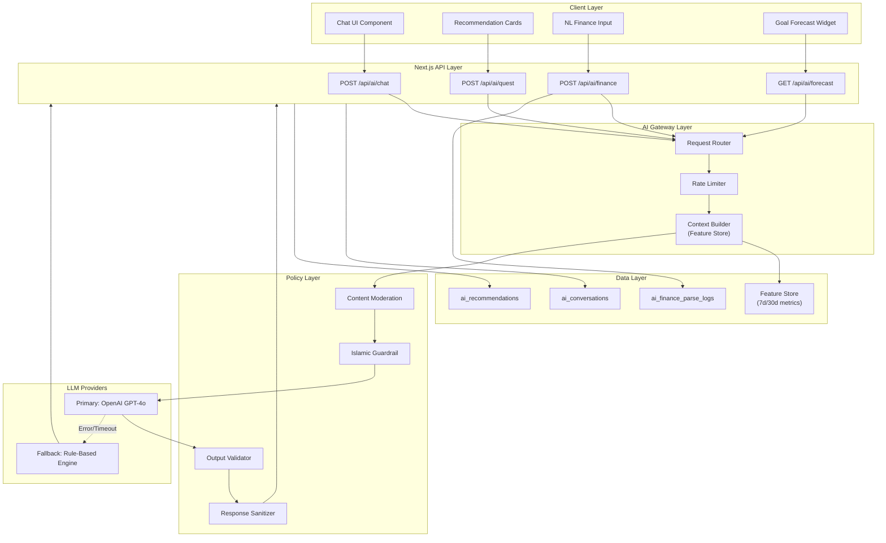
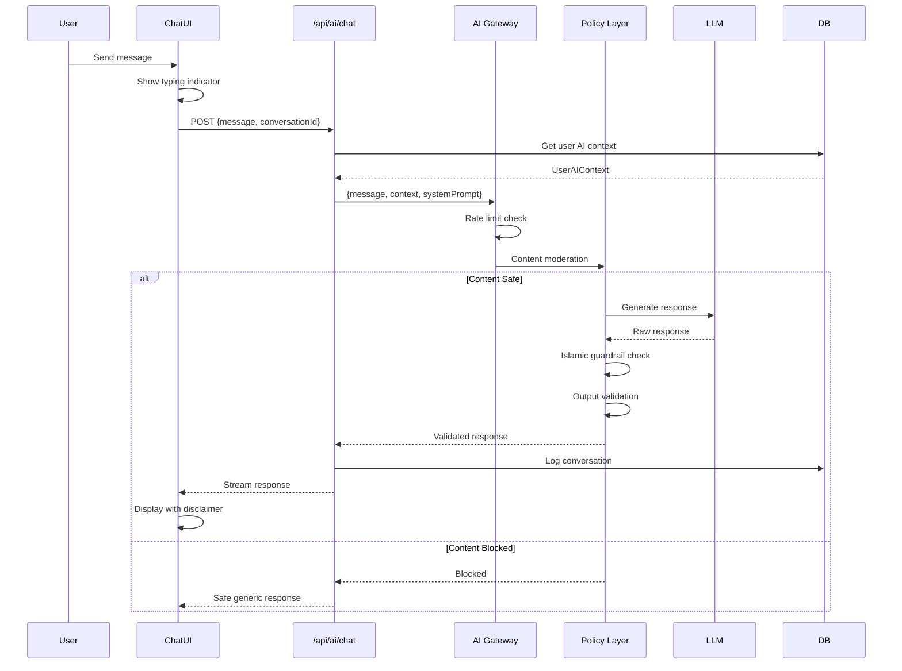
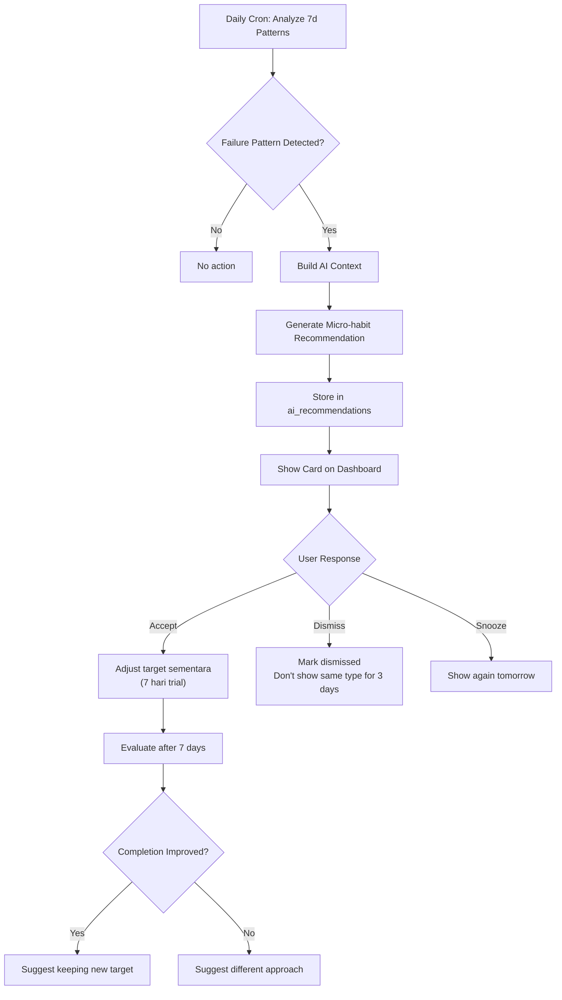
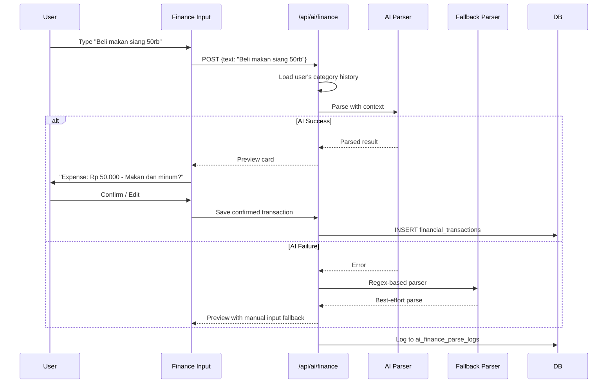
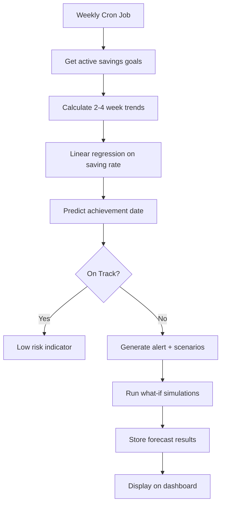
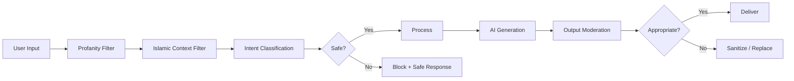

# AI Specification — Level Up Deen

> Spesifikasi lengkap fitur AI untuk Level Up Deen v1.1 dan beyond, termasuk arsitektur, guardrails, dan implementasi.

---

## 1. AI Feature Overview

AI di Level Up Deen dirancang sebagai **pendamping (assistive)**, bukan pengambil keputusan. Semua fitur AI bersifat:

- **Opt-in:** User memilih untuk mengaktifkan
- **Dismissible:** Semua rekomendasi bisa ditolak
- **Transparent:** Disclaimer ditampilkan di setiap interaksi
- **Failsafe:** Fallback ke rule-based jika AI gagal

### Feature Matrix

| Feature | Versi | Prioritas | Status |
|---------|-------|-----------|--------|
| AI Deen & Life Coach | v1.1 | P1 | Blueprint |
| Smart Quest Personalization | v1.1 | P1 | Blueprint |
| AI Finance Insight & Categorization | v1.1 | P2 | Blueprint |
| Intelligent Goal Forecasting | v1.1 | P2 | Blueprint |
| Dynamic Avatar Evolution | v1.2 | P3 | Experimental |

---

## 2. AI Architecture

### 2.1 System Architecture



### 2.2 Feature Store (Lightweight)

Feature Store menyimpan agregasi metrik user untuk memberi konteks ke AI:

```typescript
interface UserAIContext {
  // Identity (minimal)
  userId: string;
  timezone: string;
  
  // Stats
  level: number;
  rank: string;
  currentStreak: number;
  
  // 7-day metrics
  last7d: {
    completionRate: number;        // % quest selesai
    prayerCompletionRate: number;  // % shalat 5 waktu
    questsCompleted: number;
    questsFailed: string[];        // nama quest yang sering gagal
    activeCategories: string[];    // pillar yang aktif
  };
  
  // 30-day metrics
  last30d: {
    avgDailyCompletion: number;
    streakHistory: number[];       // daily streak values
    levelProgress: number;         // levels gained
    topCategories: string[];       // most active pillars
  };
  
  // Finance (aggregated only)
  financeContext?: {
    monthlyBudgetUsage: number;    // % of total budget used
    topSpendCategories: string[];  // top 3 categories
    savingsProgress: number;       // % of savings goal
    hasBudgetWarning: boolean;
  };
}
```

### 2.3 Rate Limiting

| Feature | Limit | Window |
|---------|-------|--------|
| AI Chat | 20 messages | per hour per user |
| Quest Recommendations | 5 requests | per day per user |
| Finance Parsing | 30 parses | per day per user |
| Goal Forecasting | 10 requests | per day per user |

---

## 3. Feature Specifications

### 3.1 AI Deen & Life Coach

**Requirement IDs:** FR-AI-COACH-01, FR-AI-COACH-02, FR-AI-COACH-03

**Deskripsi:** Chat assistant kontekstual yang memberikan motivasi, refleksi, dan saran manajemen waktu berdasarkan data user.

#### System Prompt Template

```
Kamu adalah pendamping (coach) di aplikasi Level Up Deen, platform pengembangan 
diri Islami berbasis gamifikasi. Tugasmu:

1. Memberikan motivasi dan dukungan yang hangat
2. Membantu user merefleksikan progres mereka
3. Memberikan saran praktis manajemen waktu dan kebiasaan
4. Menggunakan bahasa Indonesia yang ramah dan suportif

ATURAN KETAT:
- JANGAN memberikan fatwa agama
- JANGAN menilai kualitas ibadah user
- JANGAN membandingkan user dengan orang lain
- JANGAN mempermalukan user saat mereka gagal
- Selalu gunakan nada positif dan suportif
- Jika ditanya tentang hukum fiqih, arahkan ke ustadz/ustadzah terpercaya
- Fokus pada dorongan, bukan tekanan

KONTEKS USER:
Level: {level}, Rank: {rank}
Streak saat ini: {streak} hari
Completion rate 7 hari: {completionRate}%
Quest yang sering terlewat: {failedQuests}
```

#### Chat Flow



#### UI Requirements

- Chat tersedia di tab konsultasi atau floating button di dashboard
- Disclaimer permanen di atas chat area
- Maximum 50 messages per conversation session
- Conversation history tersimpan 90 hari
- User bisa clear conversation

---

### 3.2 Smart Quest Personalization

**Requirement IDs:** FR-AI-QUEST-01, FR-AI-QUEST-02, FR-AI-QUEST-03

**Deskripsi:** Sistem yang mendeteksi pola quest gagal dan merekomendasikan micro-habit untuk recovery.

#### Detection Algorithm

```typescript
interface QuestFailurePattern {
  taskId: string;
  taskName: string;
  pillar: 'deen' | 'body' | 'mind' | 'wealth' | 'discipline';
  failureRate7d: number;  // % gagal dalam 7 hari
  consecutiveFailDays: number;
  averagePartialCompletion: number; // untuk task numerik
}

// Trigger threshold
const RECOMMENDATION_TRIGGERS = {
  failureRate7d: 0.6,      // > 60% gagal dalam 7 hari
  consecutiveFailDays: 3,   // 3 hari berturut gagal
  overallCompletionDrop: 0.2 // drop > 20% dari baseline
};
```

#### Recommendation Flow



#### Recommendation Types

| Type | Trigger | Example Recommendation |
|------|---------|----------------------|
| **Target Reduction** | Numeric target consistently missed | "Kurangi target push up dari 30 ke 15 dulu ya" |
| **Schedule Shift** | Specific time tasks always missed | "Coba pindahkan tilawah ke waktu setelah Subuh" |
| **Task Simplification** | Complex tasks abandoned | "Ganti lari 5km dengan jalan kaki 15 menit" |
| **Recovery Quest** | 2+ hari consecutive fail | "Mulai dengan refleksi 3 menit + 1 task ringan" |
| **Streak Protection** | Streak about to break | "Selesaikan 1 quest mudah untuk jaga streak" |

#### Database Schema

```sql
CREATE TABLE ai_recommendations (
    id UUID PRIMARY KEY DEFAULT gen_random_uuid(),
    user_id text NOT NULL REFERENCES public.users_profile(id) ON DELETE CASCADE,
    type VARCHAR(50) NOT NULL, -- 'target_reduction', 'schedule_shift', etc.
    pillar VARCHAR(20) NOT NULL,
    related_task_id UUID REFERENCES user_tasks(id),
    recommendation_text TEXT NOT NULL,
    recommendation_data JSONB NOT NULL, -- structured recommendation
    status VARCHAR(20) DEFAULT 'pending', -- 'pending', 'accepted', 'dismissed', 'expired'
    trial_start_date DATE,
    trial_end_date DATE,
    outcome VARCHAR(20), -- 'improved', 'no_change', 'declined'
    created_at TIMESTAMPTZ DEFAULT NOW(),
    responded_at TIMESTAMPTZ,
    
    CONSTRAINT valid_status CHECK (status IN ('pending', 'accepted', 'dismissed', 'expired'))
);

-- RLS
ALTER TABLE ai_recommendations ENABLE ROW LEVEL SECURITY;
CREATE POLICY "Users can manage own recommendations" ON ai_recommendations
    FOR ALL USING (public.is_owner(user_id));
```

---

### 3.3 AI Finance Insight & Categorization

**Requirement IDs:** FR-AI-FIN-01, FR-AI-FIN-02, FR-AI-FIN-03

**Deskripsi:** Input transaksi menggunakan bahasa natural dan kategorisasi otomatis.

#### Natural Language Parsing

**Input examples:**
```
"Beli makan siang 50rb"          → { type: "expense", amount: 50000, category: "Makan dan minum" }
"Gojek ke kantor 25k"            → { type: "expense", amount: 25000, category: "Transportasi" }
"Gaji bulan ini 5jt"             → { type: "income",  amount: 5000000, category: "Gaji" }
"Sedekah jumat 100rb"            → { type: "expense", amount: 100000, category: "Ibadah dan sedekah" }
"Beli buku programming 150ribu"  → { type: "expense", amount: 150000, category: "Pendidikan" }
```

#### Parsing Flow



#### Parser Specification

```typescript
interface ParsedTransaction {
  type: 'income' | 'expense';
  amount: number;
  currency: 'IDR';
  category: string;
  categoryConfidence: number; // 0-1
  description: string;
  rawInput: string;
}

// Amount parsing rules
const AMOUNT_PATTERNS = {
  'rb': 1000,      // "50rb" → 50000
  'ribu': 1000,    // "50ribu" → 50000
  'k': 1000,       // "25k" → 25000
  'jt': 1000000,   // "5jt" → 5000000
  'juta': 1000000, // "5juta" → 5000000
};

// Fallback regex parser (non-AI)
function fallbackParse(text: string): Partial<ParsedTransaction> {
  // Extract amount using regex patterns
  // Map keywords to categories
  // Return best-effort parse
}
```

#### Category Prediction

Prediksi kategori menggunakan:
1. **User history** — Weighted frequency dari kategori sebelumnya
2. **Keyword matching** — Map kata kunci ke kategori default
3. **AI contextual** — LLM-based classification untuk input ambigu

```typescript
// Default category keyword map
const CATEGORY_KEYWORDS: Record<string, string[]> = {
  'Makan dan minum': ['makan', 'minum', 'kopi', 'resto', 'warteg', 'snack', 'lunch', 'dinner'],
  'Transportasi': ['gojek', 'grab', 'bensin', 'parkir', 'tol', 'bus', 'kereta', 'ojol'],
  'Pendidikan': ['buku', 'kursus', 'les', 'udemy', 'course', 'kuliah', 'tugas'],
  'Ibadah dan sedekah': ['sedekah', 'infaq', 'zakat', 'donasi', 'masjid', 'quran'],
  'Kesehatan': ['obat', 'dokter', 'vitamin', 'apotek', 'rumah sakit'],
  'Hiburan': ['nonton', 'game', 'spotify', 'netflix', 'bioskop'],
  'Belanja pribadi': ['baju', 'sepatu', 'tas', 'skincare', 'parfum'],
  'Kuota dan langganan': ['kuota', 'wifi', 'listrik', 'air', 'subscription'],
};
```

#### Weekly Spending Insight

AI menghasilkan ringkasan kebiasaan belanja mingguan:

```typescript
interface WeeklyInsight {
  summary: string;           // "Minggu ini pengeluaran kamu turun 15% 🎉"
  topCategory: string;       // "Makan dan minum"
  topCategoryAmount: number;
  budgetStatus: string;      // "Masih dalam budget" / "Perlu perhatian"
  suggestion: string;        // "Coba bawa bekal 2x seminggu"
  tone: 'positive' | 'neutral' | 'gentle_warning';
}
```

---

### 3.4 Intelligent Goal Forecasting

**Requirement IDs:** FR-AI-GOAL-01, FR-AI-GOAL-02, FR-AI-GOAL-03

**Deskripsi:** Prediksi estimasi pencapaian savings goal berdasarkan tren pengeluaran.

#### Forecasting Model

```typescript
interface SavingsGoalForecast {
  goalId: string;
  goalName: string;
  targetAmount: number;
  currentAmount: number;
  targetDate: string;         // ISO date
  
  // Predictions
  predictedDate: string;      // estimated achievement date
  onTrack: boolean;
  riskLevel: 'low' | 'medium' | 'high';
  
  // Trend data (2-4 weeks)
  weeklyAvgSaving: number;
  weeklyAvgExpense: number;
  savingTrend: 'increasing' | 'stable' | 'decreasing';
  
  // Simulations
  scenarios: SimulationScenario[];
}

interface SimulationScenario {
  description: string;        // "Kurangi makan di luar 30%"
  categoryAdjustment: {
    category: string;
    reductionPercent: number;
  };
  newPredictedDate: string;
  daysAccelerated: number;
}
```

#### Forecast Flow



#### Risk Alert Rules

| Condition | Risk Level | Action |
|-----------|-----------|--------|
| Predicted date within target ± 7 days | Low | Green indicator |
| Predicted date 8-30 days after target | Medium | Yellow warning + suggestions |
| Predicted date > 30 days after target | High | Red alert + simulation options |
| Saving rate declining 3 weeks consecutive | High | Proactive alert |

---

### 3.5 Dynamic Avatar Evolution (v1.2 — Experimental)

**Requirement IDs:** FR-AI-AVA-01, FR-AI-AVA-02, FR-AI-AVA-03

**Deskripsi:** Avatar aura/effect yang berubah berdasarkan pilar progres dominan user.

#### Evolution Rules

| Dominant Pillar | Aura/Effect | Trigger |
|----------------|-------------|---------|
| Deen (> 40% of total EXP) | Golden spiritual glow | Consistent prayer + sunnah |
| Body (> 30% of total EXP) | Iron/steel particle effect | High fitness completion |
| Mind (> 30% of total EXP) | Arcane/knowledge symbols | Reading + learning streak |
| Wealth (> 25% of total EXP) | Emerald/prosperity shimmer | Consistent finance tracking |
| Balanced (all pillars ±15%) | Rainbow/prismatic aura | Well-rounded progression |

#### Constraints

- Evolusi bersifat **kosmetik only** — tidak mempengaruhi skor ibadah
- User bisa mematikan efek dinamis dari settings
- Evolution calculation berjalan daily, bukan real-time
- Tidak ada pembelian evolution — hanya earned through progress

---

## 4. AI Safety & Moderation

### 4.1 Content Safety Pipeline



### 4.2 Blocked Topics

AI harus menolak atau redirect untuk topik:

| Topic | Response Strategy |
|-------|-------------------|
| Fatwa / hukum fiqih detail | Redirect ke ustadz terpercaya |
| Perbandingan mazhab | Netral, redirect ke sumber otoritatif |
| Kritik ibadah user | Tolak, ganti dengan dorongan |
| Data user lain | Block |
| Self-harm / violence | Block + resource link |
| Konten politik | Redirect ke topik produktivitas |

### 4.3 Monitoring & Observability

| Metric | Target | Alert |
|--------|--------|-------|
| AI response latency (p95) | ≤ 3s | > 5s |
| Fallback rate | ≤ 10% | > 20% |
| Content filter trigger rate | ≤ 5% | > 15% |
| User satisfaction (thumbs up/down) | ≥ 70% positive | < 50% |
| Recommendation acceptance rate | ≥ 30% | < 15% |

### 4.4 Audit Logging Schema

```sql
CREATE TABLE ai_conversations (
    id UUID PRIMARY KEY DEFAULT gen_random_uuid(),
    user_id text NOT NULL REFERENCES public.users_profile(id) ON DELETE CASCADE,
    session_id UUID NOT NULL,
    message_role VARCHAR(20) NOT NULL, -- 'user', 'assistant', 'system'
    message_hash TEXT NOT NULL,        -- hashed content for audit (not raw)
    intent VARCHAR(50),               -- classified intent
    tokens_used INTEGER,
    model_version VARCHAR(50),
    safety_flags JSONB DEFAULT '[]',
    latency_ms INTEGER,
    created_at TIMESTAMPTZ DEFAULT NOW()
);

CREATE TABLE ai_finance_parse_logs (
    id UUID PRIMARY KEY DEFAULT gen_random_uuid(),
    user_id text NOT NULL REFERENCES public.users_profile(id) ON DELETE CASCADE,
    raw_input TEXT NOT NULL,
    parsed_result JSONB NOT NULL,
    category_confidence FLOAT,
    was_corrected BOOLEAN DEFAULT FALSE,
    correction_data JSONB,            -- what user changed
    model_version VARCHAR(50),
    created_at TIMESTAMPTZ DEFAULT NOW()
);

-- RLS
ALTER TABLE ai_conversations ENABLE ROW LEVEL SECURITY;
ALTER TABLE ai_finance_parse_logs ENABLE ROW LEVEL SECURITY;

CREATE POLICY "Users can view own conversations" ON ai_conversations
    FOR SELECT USING (public.is_owner(user_id));
CREATE POLICY "Users can view own parse logs" ON ai_finance_parse_logs
    FOR SELECT USING (public.is_owner(user_id));
```

---

## 5. Implementation Roadmap

### Phase 1: Foundation (v1.1 Sprint 1-2)

- [ ] Setup AI Gateway infrastructure
- [ ] Implement Policy Layer (moderation + Islamic guardrails)
- [ ] Build Feature Store (7d/30d metric aggregation)
- [ ] Implement rate limiting
- [ ] Setup audit logging tables

### Phase 2: Core Features (v1.1 Sprint 3-4)

- [ ] AI Chat (Deen & Life Coach)
- [ ] Smart Quest Personalization
- [ ] Fallback rule-based engine
- [ ] Integration testing

### Phase 3: Finance AI (v1.1 Sprint 5-6)

- [ ] Natural language finance parser
- [ ] Category prediction engine
- [ ] Weekly spending insights
- [ ] Goal forecasting

### Phase 4: Polish & Monitor (v1.1 Sprint 7-8)

- [ ] Monitoring dashboard
- [ ] A/B testing framework for AI features
- [ ] User feedback collection
- [ ] Model performance tuning

### Phase 5: Advanced (v1.2+)

- [ ] Dynamic Avatar Evolution
- [ ] Advanced analytics
- [ ] Multi-language support
- [ ] Personalized prompt templates

---

## 6. Cost Estimation

### Token Usage Estimates (Monthly)

| Feature | Avg Tokens/Request | Daily Requests (1K users) | Monthly Cost (GPT-4o) |
|---------|-------------------|---------------------------|----------------------|
| AI Chat | ~500 input + 300 output | ~2,000 | ~$30 |
| Quest Reco | ~400 input + 200 output | ~500 | ~$5 |
| Finance Parse | ~200 input + 100 output | ~3,000 | ~$10 |
| Goal Forecast | ~600 input + 400 output | ~200 | ~$5 |
| **Total** | | | **~$50/month** |

*Estimates based on GPT-4o pricing. Actual costs may vary with model selection and usage patterns.*

### Cost Optimization Strategies

1. **Caching:** Cache identical/similar queries
2. **Batching:** Group recommendation generation in cron jobs
3. **Model selection:** Use cheaper models (GPT-4o-mini) for simpler tasks
4. **Fallback first:** Try rule-based before AI for common patterns
5. **Token budgeting:** Set max token limits per feature
