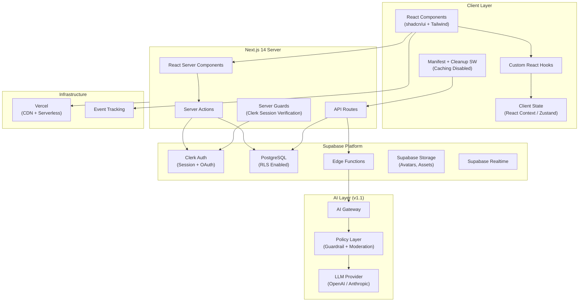
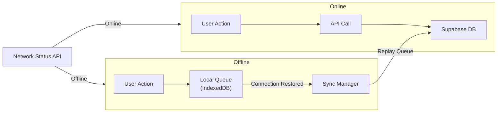
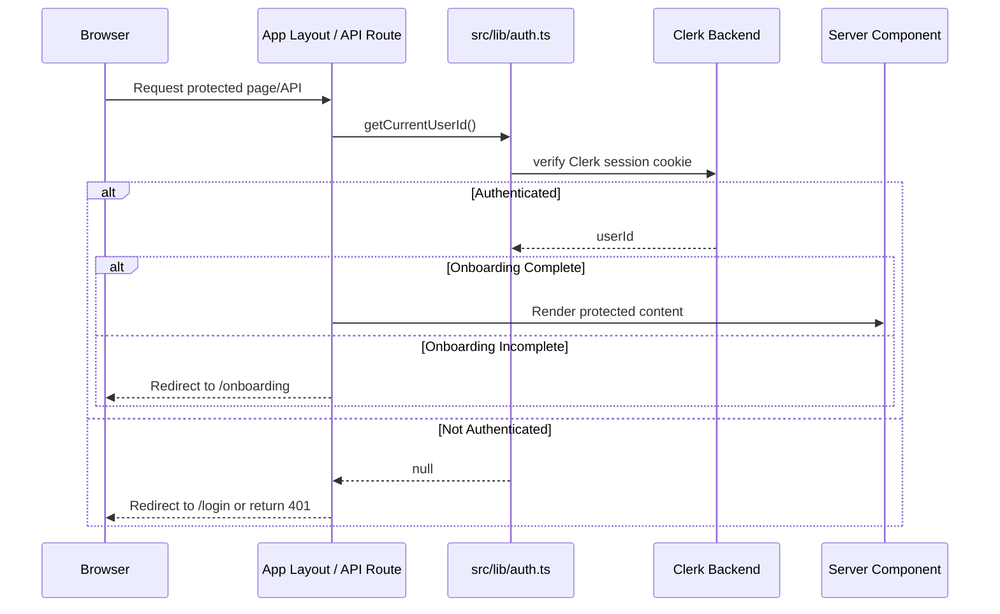
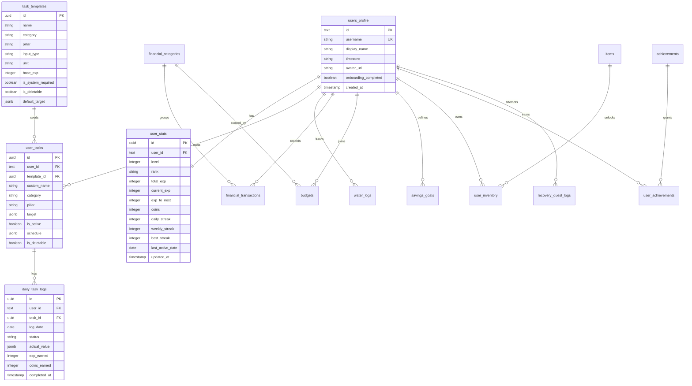
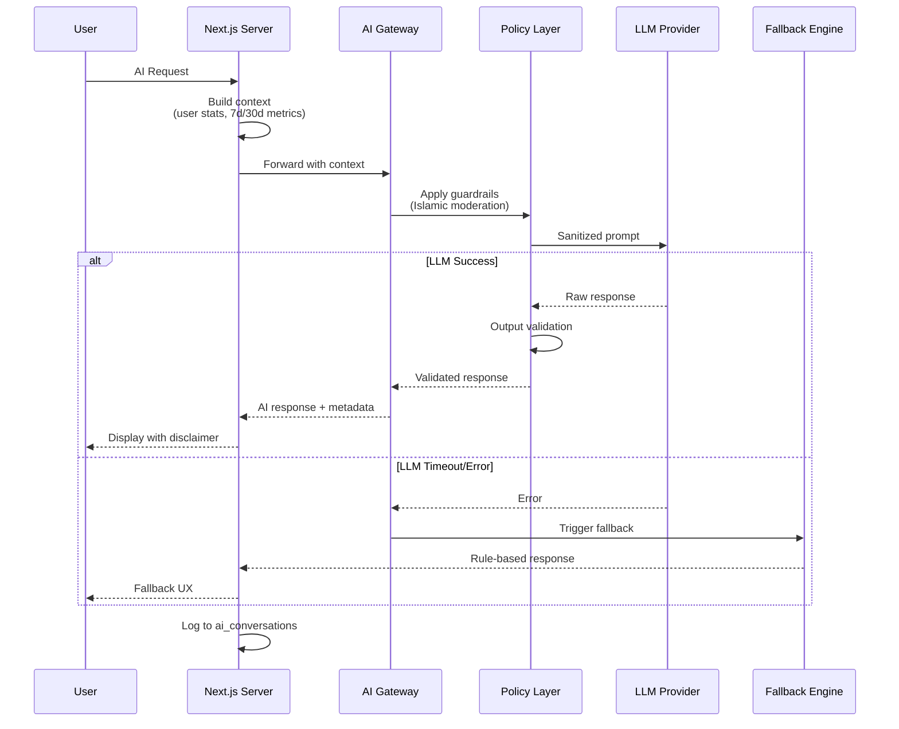
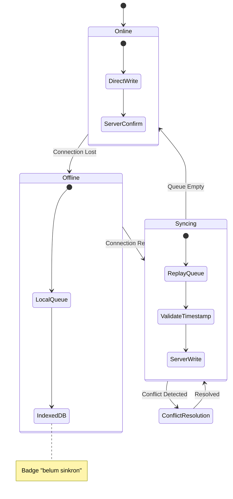
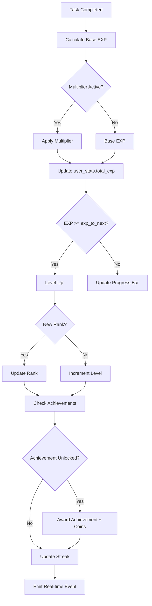
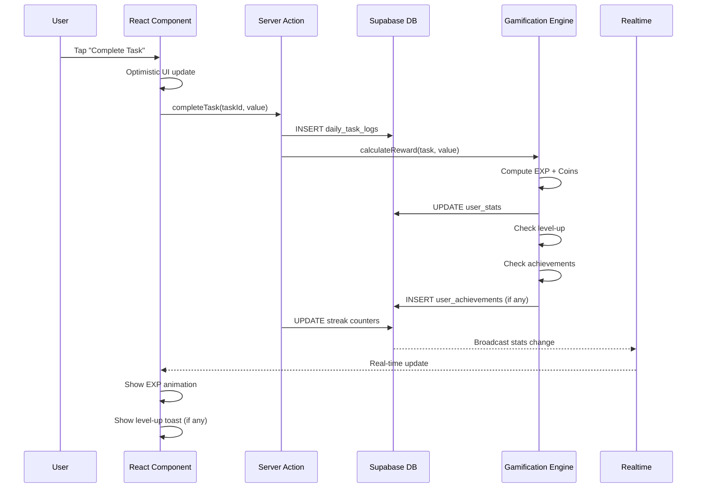
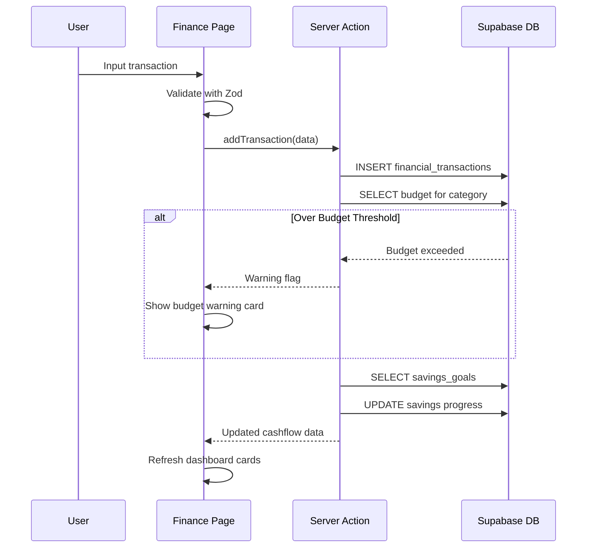

# Architecture — Level Up Deen

> System architecture, design patterns, dan keputusan teknis Level Up Deen.

---

## 1. Architecture Overview

Level Up Deen menggunakan arsitektur **berlapis (layered architecture)** yang dibangun di atas Next.js 14 App Router, Clerk sebagai auth/authorization provider, dan Supabase sebagai Backend-as-a-Service untuk persistence.

### High-Level Architecture



---

## 2. Layer Breakdown

### 2.1 Client Layer

**Tanggung jawab:**
- Rendering UI (mobile-first, responsive)
- Client-side state management
- Online-first user interactions
- Future offline data queue & sync
- Future push notification handling

**Komponen utama:**

| Module | Teknologi | Deskripsi |
|--------|-----------|-----------|
| UI Components | React 18 + shadcn/ui | Modular, accessible component library |
| Styling | Tailwind CSS 3.4 | Utility-first, custom dark fantasy theme |
| State | React Context + Zustand | Lightweight state untuk session & UI |
| Forms | React Hook Form + Zod | Validated form handling |
| Charts | Recharts | Visualisasi progress & finance |
| PWA | Manifest + cleanup service worker | Install metadata retained; caching disabled |
| Sync | Future Queue Manager | Offline queue is backlog scope |

**Future Offline Architecture:**



### 2.2 Server Layer (Next.js 14)

**Tanggung jawab:**
- Server-side rendering & data fetching
- Server-side auth guards in layouts and API routes
- Server Actions untuk data mutations
- API routes untuk complex operations

**Routing Structure:**

```
src/app/
├── page.tsx                    # Public command center
├── login/page.tsx              # Public login page
├── register/page.tsx           # Public registration page
├── sign-in/[[...sign-in]]      # Clerk sign-in catch-all
├── sign-up/[[...sign-up]]      # Clerk sign-up catch-all
├── onboarding/page.tsx         # Onboarding outside app shell
├── (app)/                      # Protected app routes
│   ├── layout.tsx              # Auth/profile guard + shell
│   ├── dashboard/page.tsx
│   ├── quests/page.tsx
│   ├── deen/page.tsx
│   ├── fitness/page.tsx
│   ├── water/page.tsx
│   ├── finance/page.tsx
│   ├── planning/page.tsx
│   ├── avatar/page.tsx
│   ├── ai-coach/page.tsx
│   ├── squad/page.tsx
│   ├── history/page.tsx
│   ├── achievements/page.tsx
│   ├── settings/page.tsx
│   └── admin/
└── api/
    ├── health/route.ts
    ├── onboarding/route.ts
    ├── tasks/route.ts
    ├── tasks/complete/route.ts
    ├── finance/transactions/route.ts
    ├── planning/budgets/route.ts
    ├── planning/savings-goals/route.ts
    ├── settings/
    ├── admin/users/route.ts
    └── ai/
```

**Server Guard Flow:**



### 2.3 Data Layer (Supabase)

**Tanggung jawab:**
- Persistent data storage (PostgreSQL)
- User-scoped persistence for Clerk-authenticated users
- Row Level Security (RLS)
- File storage (avatars, assets)
- Realtime subscriptions

**Database Schema Overview:**



### 2.4 AI Layer (v1.1+)

**Tanggung jawab:**
- Contextual coaching & motivation
- Smart quest recommendation
- Natural language finance parsing
- Goal forecasting

**AI Request Flow:**



---

## 3. Design Patterns

### 3.1 Server Components First

Gunakan React Server Components (RSC) sebagai default. Client Components hanya untuk:
- Interaktivitas (event handlers, forms)
- Browser APIs (localStorage, geolocation)
- Real-time subscriptions
- State yang berubah (hooks)

```
"use client" → Hanya jika PERLU interaktivitas
default     → Server Component (data fetching, rendering)
```

### 3.2 Server Actions Pattern

Data mutations menggunakan Server Actions, bukan API routes:

```typescript
// src/app/(dashboard)/quest/actions.ts
'use server'

import { createServerClient } from '@/lib/supabase/server'
import { revalidatePath } from 'next/cache'

export async function completeTask(taskId: string, actualValue: number) {
  const supabase = createServerClient()
  const { data: { user } } = await supabase.auth.getUser()
  
  if (!user) throw new Error('Unauthorized')

  // 1. Insert daily log
  await supabase.from('daily_task_logs').insert({
    user_id: user.id,
    task_id: taskId,
    log_date: new Date().toISOString().split('T')[0],
    status: 'completed',
    actual_value: { value: actualValue },
  })

  // 2. Calculate & award EXP
  const expResult = await calculateExpReward(taskId, actualValue)
  
  // 3. Update user stats
  await updateUserStats(user.id, expResult)

  revalidatePath('/dashboard')
  revalidatePath('/quest')
}
```

### 3.3 Supabase Client Pattern

**Server-side client** (Server Components & Server Actions):

```typescript
// src/lib/supabase/server.ts
import { createServerClient as createClient } from '@supabase/ssr'
import { cookies } from 'next/headers'

export function createServerClient() {
  const cookieStore = cookies()
  return createClient(
    process.env.NEXT_PUBLIC_SUPABASE_URL!,
    process.env.NEXT_PUBLIC_SUPABASE_ANON_KEY!,
    {
      cookies: {
        get: (name) => cookieStore.get(name)?.value,
        set: (name, value, options) => cookieStore.set({ name, value, ...options }),
        remove: (name, options) => cookieStore.set({ name, value: '', ...options }),
      },
    }
  )
}
```

**Client-side client** (Client Components):

```typescript
// src/lib/supabase/client.ts
import { createBrowserClient } from '@supabase/ssr'

export function createBrowserSupabase() {
  return createBrowserClient(
    process.env.NEXT_PUBLIC_SUPABASE_URL!,
    process.env.NEXT_PUBLIC_SUPABASE_ANON_KEY!,
  )
}
```

### 3.4 Offline-First Sync Pattern



**Conflict Resolution Rules:**
- **Notes/Values:** Last-write-wins berdasarkan `client_timestamp`
- **Completion logs:** Immutable setelah tersimpan final
- **Financial transactions:** Idempotent berdasarkan `client_id`

### 3.5 Gamification Engine Pattern



---

## 4. Data Flow

### 4.1 Daily Quest Completion Flow



### 4.2 Finance Transaction Flow



---

## 5. Performance Strategy

### 5.1 Target Metrics

| Metric | Target | Strategy |
|--------|--------|----------|
| Time to Interactive | ≤ 3s (4G) | SSR + code splitting |
| First Contentful Paint | ≤ 1.5s | Server Components + streaming |
| P95 API Latency | ≤ 800ms | Edge functions + DB indexes |
| Availability | ≥ 99.5% | Vercel + Supabase SLA |

### 5.2 Optimization Techniques

| Technique | Implementation |
|-----------|---------------|
| **Code Splitting** | Next.js automatic per-route splitting |
| **Image Optimization** | `next/image` with WebP, lazy loading |
| **Static Generation** | ISR for landing page, shop catalog |
| **Database Indexing** | Composite indexes on `(user_id, log_date)` |
| **Connection Pooling** | Supabase built-in PgBouncer |
| **Caching** | React `cache()` + `unstable_cache` for computed stats |
| **Bundle Analysis** | `@next/bundle-analyzer` untuk monitoring |

---

## 6. Monitoring & Observability

### 6.1 Event Tracking

Semua event berikut wajib di-track:

```typescript
// Event taxonomy
type AppEvent =
  | 'onboarding_completed'
  | 'quest_completed'
  | 'streak_updated'
  | 'level_up'
  | 'rank_up'
  | 'transaction_logged'
  | 'budget_warning_shown'
  | 'item_purchased'
  | 'achievement_unlocked'
  | 'sync_completed'
  | 'sync_conflict'
  | 'ai_chat_sent'          // v1.1
  | 'ai_recommendation_accepted' // v1.1
```

### 6.2 Error Monitoring

| Category | Tool | Alert Threshold |
|----------|------|-----------------|
| Client Errors | Vercel Analytics / Sentry | > 5 errors/min |
| Server Errors | Vercel Logs | 5xx > 1% |
| Auth Failures | Supabase Dashboard | Spike detection |
| Sync Failures | Custom logging | > 3 retries |
| AI Errors | AI Gateway logs | Timeout > 10% |

---

## 7. Scalability Considerations

### Current (MVP)

- **Users:** < 1,000 concurrent
- **Database:** Single Supabase instance (Free/Pro tier)
- **Deployment:** Vercel Hobby/Pro

### Future Scaling Path

| Scale Point | Action |
|-------------|--------|
| > 5K DAU | Supabase Pro + read replicas |
| > 20K DAU | Vercel Pro + edge caching |
| > 50K DAU | Supabase Enterprise + CDN for assets |
| > 100K DAU | Consider dedicated infra + microservices |

---

## 8. Directory Conventions

```
src/
├── app/                    # Routes & pages (Next.js App Router)
│   ├── (group)/           # Route groups (no URL impact)
│   │   ├── page.tsx       # Page component
│   │   ├── layout.tsx     # Layout for group
│   │   ├── loading.tsx    # Loading UI
│   │   ├── error.tsx      # Error boundary
│   │   └── actions.ts     # Server Actions
├── components/             # React components
│   ├── ui/                # Atomic design primitives
│   ├── [feature]/         # Feature-specific components
│   └── layout/            # Shell, navigation, sidebar
├── lib/                   # Business logic & utilities
│   ├── supabase/          # Database clients
│   ├── gamification/      # Game engine logic
│   └── validators/        # Zod schemas
├── hooks/                 # Custom React hooks
├── types/                 # TypeScript interfaces/types
├── constants/             # Static configuration values
└── stores/                # Client-side state stores
```

### Naming Conventions

| Type | Convention | Example |
|------|-----------|---------|
| Components | PascalCase | `QuestCard.tsx` |
| Hooks | camelCase with `use` prefix | `useGameStats.ts` |
| Utilities | camelCase | `calculateExp.ts` |
| Types | PascalCase | `UserProfile.ts` |
| Constants | SCREAMING_SNAKE_CASE | `EXP_TABLE.ts` |
| Server Actions | camelCase | `completeTask.ts` |
| CSS Classes | kebab-case (Tailwind) | `dark-fantasy-card` |
