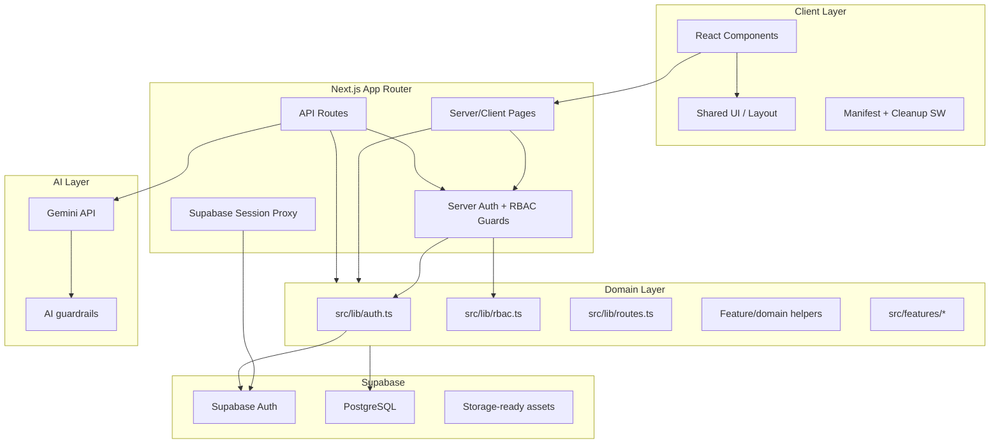

# Architecture - Level Up Deen

> System architecture, design patterns, and current technical decisions.

## Overview

Level Up Deen uses a layered architecture built on Next.js 16 App Router, TypeScript, Tailwind CSS, and Supabase.

Supabase is the canonical source for:

- authentication sessions
- application identity
- app roles through `users_profile.role`
- PostgreSQL persistence

## High-Level Architecture



## Top-Level Components

| Component | Path | Responsibility |
| --- | --- | --- |
| App routes | `src/app/**` | Public pages, protected pages, layouts, API routes |
| Feature UI | `src/components/{deen,finance,fitness,planning,quests,squad,...}` | Product workflows and interaction state |
| Shared UI/layout | `src/components/{ui,layout,auth,pwa}` | Reusable controls, navigation, shell, cleanup PWA behavior |
| Domain libraries | `src/lib/**` | Auth, RBAC, route constants, Supabase clients, business helpers |
| Feature core | `src/features/**` | Validation schemas and AI guardrails independent from UI |
| Proxy | `src/proxy.ts` | Supabase session refresh and route redirects |
| Supabase schema | `supabase/migrations/**` | Database schema, audit tables, role/email columns |
| Tests/scripts | `src/lib/__tests__/**`, `scripts/**` | Verification and workflow checks |

## Routing Structure

```text
src/app/
├── page.tsx
├── login/page.tsx
├── register/page.tsx
├── onboarding/page.tsx
├── (app)/
│   ├── layout.tsx
│   ├── dashboard/page.tsx
│   ├── quests/page.tsx
│   ├── deen/page.tsx
│   ├── fitness/page.tsx
│   ├── water/page.tsx
│   ├── finance/page.tsx
│   ├── planning/page.tsx
│   ├── avatar/page.tsx
│   ├── ai-coach/page.tsx
│   ├── squad/page.tsx
│   ├── settings/page.tsx
│   └── admin/
└── api/
    ├── health/route.ts
    ├── onboarding/route.ts
    ├── tasks/
    ├── finance/
    ├── planning/
    ├── settings/
    ├── squad/
    ├── admin/
    └── ai/
```

## Dependency Rules

- `src/app/**` may depend on `src/components/**`, `src/lib/**`, and `src/features/**`.
- `src/components/**` may depend on `src/lib/**`, `src/features/**`, and shared UI components.
- `src/lib/**` must not depend on `src/app/**` or feature UI components.
- `src/features/**` must not depend on `src/app/**` or `src/components/**`.
- API routes must enforce server-side auth and user ownership before reading or mutating data.
- Admin routes and APIs must require `admin_system`.
- Core workflow paths should use `src/lib/routes.ts`.

## PWA State

Manifest support remains, but Workbox runtime caching is disabled. `public/sw.js` is a cleanup worker that clears stale caches and unregisters itself.
