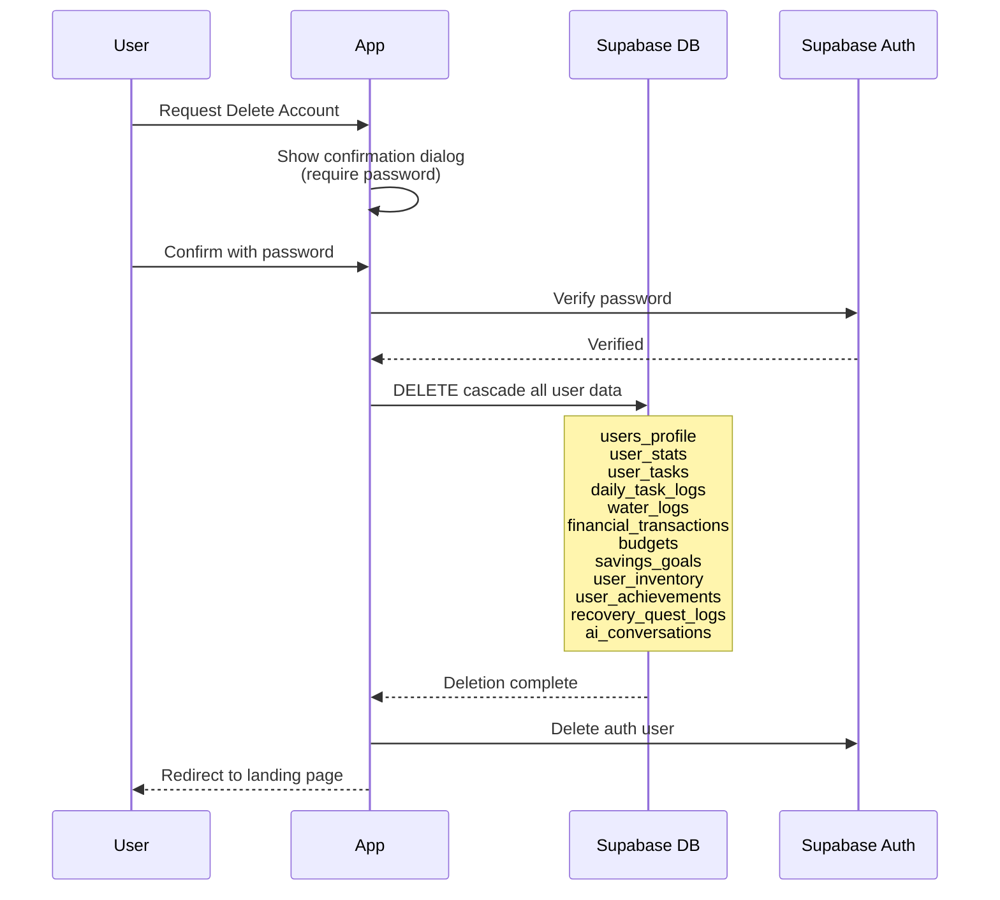
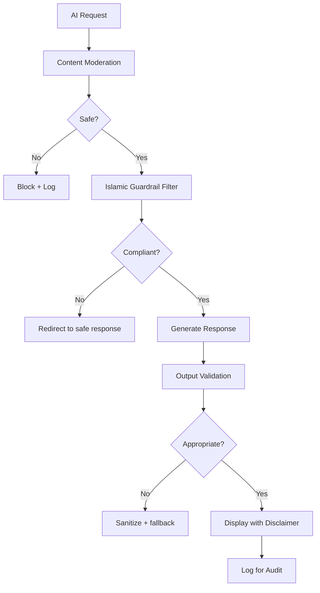

# Compliance — Level Up Deen

> Panduan kepatuhan etika, privasi, aksesibilitas, dan nilai Islami untuk pengembangan dan operasional Level Up Deen.

---

## 1. Prinsip Kepatuhan Utama

Level Up Deen berkomitmen pada empat pilar kepatuhan:

| Pilar | Deskripsi |
|-------|-----------|
| **Etika Islami** | Produk tidak menilai kualitas ibadah; gamifikasi sebagai motivasi, bukan ukuran keimanan |
| **Privasi Data** | Data personal dilindungi ketat; data finansial bersifat privat absolut |
| **Aksesibilitas** | Mobile-first, minimal friction, inklusif untuk berbagai tingkat literasi digital |
| **Transparansi AI** | AI memberikan disclaimer, tidak memberi fatwa, semua rekomendasi bisa ditolak |

---

## 2. Kepatuhan Etika Islami

### 2.1 Prinsip Dasar

1. **Gamifikasi bukan pengukur ibadah**
   - Poin, rank, dan badge adalah alat motivasi aplikasi, **bukan ukuran nilai ibadah di sisi Allah**
   - Setiap elemen gamifikasi harus mengikuti disclaimer ini

2. **Bahasa suportif, non-judgmental**
   - Copywriting aplikasi wajib rendah judgment
   - Tidak ada bahasa yang mempermalukan user saat gagal menyelesaikan quest
   - Fokus pada dorongan dan keberlanjutan, bukan tekanan

3. **Shalat wajib bersifat permanen**
   - 5 waktu shalat (`is_deletable=false`, `is_system_required=true`)
   - Tidak bisa dihapus, dinonaktifkan, atau dimanipulasi oleh user
   - Completion rate shalat tidak dipublikasikan di leaderboard

4. **Sunnah fleksibel**
   - User dapat menambah, mengubah, menjadwalkan, dan menonaktifkan ibadah sunnah
   - Tidak ada penalti berat untuk sunnah yang terlewat

### 2.2 Konten & Copywriting Guidelines

| Situasi | ✅ Diperbolehkan | ❌ Tidak Diperbolehkan |
|---------|-------------------|------------------------|
| Quest gagal | "Tidak apa-apa, besok coba lagi! 💪" | "Kamu gagal menjalankan ibadah!" |
| Streak putus | "Streak reset, tapi kamu bisa mulai baru!" | "Kamu tidak disiplin!" |
| Recovery | "Yuk, mulai dari yang ringan dulu" | "Kamu harus mengejar ketinggalan" |
| Level up | "Alhamdulillah, progres kamu luar biasa!" | "Kamu lebih baik dari user lain" |
| Finance warning | "Reminder: pengeluaran mendekati budget" | "Kamu boros!" |

### 2.3 Batasan Kompetisi

- **MVP:** Tidak ada leaderboard publik
- **v1.1 Leaderboard Lite:**
  - Hanya menampilkan completion score mingguan (bukan detail ibadah wajib)
  - Data finansial **TIDAK PERNAH** ditampilkan di leaderboard
  - Detail ibadah per waktu bersifat privat
  - Leaderboard bersifat opt-in

### 2.4 Review Checklist Konten

Sebelum rilis fitur atau update copywriting:

- [ ] Tidak ada bahasa yang menghakimi user
- [ ] Gamifikasi tidak diposisikan sebagai pengganti ibadah
- [ ] Disclaimer tercantum di tempat yang relevan
- [ ] Tidak ada perbandingan antar user terkait ibadah wajib
- [ ] Bahasa Islami digunakan secara natural, bukan dipaksakan

---

## 3. Kepatuhan Privasi Data

### 3.1 Prinsip Data

| Prinsip | Implementasi |
|---------|-------------|
| **Data Minimization** | Hanya kumpulkan data yang benar-benar diperlukan |
| **Purpose Limitation** | Data digunakan sesuai tujuan yang dinyatakan |
| **User Control** | User bisa export dan delete semua data mereka |
| **Privacy by Default** | Default pengaturan privasi selalu di posisi paling ketat |
| **Encryption in Transit** | Semua komunikasi via HTTPS/TLS |

### 3.2 Klasifikasi Data

| Klasifikasi | Contoh Data | Perlakuan |
|------------|-------------|-----------|
| **Public** | Username, rank, level, avatar | Bisa ditampilkan di leaderboard (opt-in) |
| **Personal** | Email, display name, timezone | Hanya visible oleh pemilik |
| **Sensitive** | Data finansial, savings goal, budget | Privat absolut, tidak pernah di-share |
| **Behavioral** | Quest completion, streak, EXP | Agregasi saja di leaderboard (non-detail) |
| **Religious** | Detail shalat per waktu, tilawah | Privat absolut |

### 3.3 Data Retention Policy

| Data Type | Retention | Penjelasan |
|-----------|-----------|------------|
| User profile | Hingga account deletion | Core identity |
| Daily task logs | Permanent (untuk analytics personal) | Histori progres |
| Financial transactions | Permanent | Laporan keuangan |
| Water logs | 1 tahun rolling | Trend data |
| AI conversations | 90 hari | Sesuai kebutuhan coaching |
| Sync queue logs | 30 hari | Debugging & audit |
| Audit logs | 1 tahun | Keamanan & compliance |

### 3.4 User Rights (GDPR-Inspired)

Meskipun bukan mandatory GDPR (target market Indonesia), Level Up Deen menerapkan best practices:

| Right | Fitur |
|-------|-------|
| **Right to Access** | Export semua data personal (JSON/CSV) via Settings |
| **Right to Rectification** | Edit profil, task, dan data kapan saja |
| **Right to Erasure** | Delete account + semua data terkait |
| **Right to Data Portability** | Export dalam format standar |
| **Right to Object** | Opt-out dari leaderboard, push notifications, AI features |

### 3.5 Delete Account Flow



---

## 4. Kepatuhan AI (v1.1+)

### 4.1 AI Ethics Framework



### 4.2 AI Guardrails

| Rule | Deskripsi |
|------|-----------|
| **No Fatwa** | AI tidak memberikan fatwa final; hanya dukungan motivasi dan praktis |
| **No Ibadah Judgment** | AI tidak menilai "kualitas ibadah" pengguna |
| **Supportive Tone** | Output wajib nada suportif, tanpa mempermalukan user |
| **User Consent** | Semua rekomendasi AI bisa ditolak user |
| **No Auto-Execute** | Perubahan sensitif tidak dieksekusi otomatis tanpa konfirmasi |
| **Data Minimization** | AI hanya menerima fitur yang relevan, bukan semua data user |
| **Logging** | Semua prompt dan respons di-log untuk audit |

### 4.3 AI Disclaimer Template

Setiap interaksi AI wajib menampilkan disclaimer:

```
⚠️ Saran ini bersifat pendamping dan bukan merupakan fatwa agama.
Untuk pertanyaan fiqih, silakan konsultasikan dengan ustadz/ustadzah terpercaya.
```

### 4.4 AI Fallback Policy

| Kondisi | Fallback |
|---------|----------|
| LLM timeout (> 10s) | Rule-based recommendation |
| LLM error/unavailable | Static motivational messages |
| Content filter triggered | Generic supportive response |
| Output validation failed | Sanitized safe response |

### 4.5 AI Data Scope

Data yang **BOLEH** dikirim ke AI:
- Agregasi completion rate (7/30 hari)
- Streak status
- Category-level spending trend (bukan detail transaksi)
- Quest names yang sering gagal
- User-defined goals

Data yang **TIDAK BOLEH** dikirim ke AI:
- Email, password, atau identitas lengkap
- Nominal transaksi spesifik
- Detail ibadah per waktu secara granular
- Data user lain

---

## 5. Kepatuhan Aksesibilitas

### 5.1 Target Standard

Level Up Deen mengacu pada **WCAG 2.1 Level AA** sebagai panduan:

| Aspek | Requirement |
|-------|------------|
| **Contrast** | Minimum 4.5:1 untuk teks normal, 3:1 untuk teks besar |
| **Touch Target** | Minimum 44x44px untuk elemen interaktif |
| **Font Size** | Minimum 14px base, scalable |
| **Focus Indicator** | Visible focus state untuk keyboard navigation |
| **Alt Text** | Semua gambar meaningful memiliki alt text |
| **Error Messages** | Jelas, actionable, dan terkait field yang error |

### 5.2 Mobile-First Considerations

| Aspek | Implementation |
|-------|---------------|
| **Minimum Width** | Support 360px viewport |
| **Task Completion** | 1-2 tap maximum |
| **Input Modes** | Numeric keyboard untuk angka, appropriate input types |
| **Offline Indicator** | Badge "belum sinkron" yang jelas |
| **Loading States** | Skeleton screens, bukan blank page |
| **Error Recovery** | Tombol retry yang jelas saat sync gagal |

---

## 6. Kepatuhan Operasional

### 6.1 Audit Log Events

Event berikut wajib di-log untuk keperluan audit:

| Event | Data yang Di-log |
|-------|-----------------|
| `auth.login` | user_id, method, timestamp, IP |
| `auth.register` | user_id, method, timestamp |
| `auth.logout` | user_id, timestamp |
| `auth.password_change` | user_id, timestamp |
| `account.delete` | user_id, timestamp |
| `transaction.create` | user_id, amount, category, timestamp |
| `item.purchase` | user_id, item_id, coin_spent, timestamp |
| `level.up` | user_id, old_level, new_level, timestamp |
| `data.export` | user_id, format, timestamp |
| `ai.chat` | user_id, intent, timestamp (bukan content) |
| `ai.recommendation` | user_id, type, status, timestamp |

### 6.2 Incident Response

| Severity | Contoh | Response Time | Escalation |
|----------|--------|--------------|------------|
| **Critical** | Data breach, auth bypass | < 1 jam | Immediate team notification |
| **High** | Data corruption, sync failure widespread | < 4 jam | Team lead notification |
| **Medium** | Feature bug blocking core loop | < 24 jam | Sprint backlog |
| **Low** | UI glitch, cosmetic issue | Next sprint | Regular backlog |

---

## 7. Checklist Kepatuhan Per Release

### Pre-Release Checklist

- [ ] **Etika Islami**
  - [ ] Review semua copywriting baru
  - [ ] Verifikasi disclaimer gamifikasi
  - [ ] Test bahwa shalat 5 waktu tidak bisa dihapus
  - [ ] Pastikan data ibadah detail tidak muncul di fitur sosial

- [ ] **Privasi**
  - [ ] RLS policies ter-test untuk semua tabel baru
  - [ ] Data finansial tetap privat
  - [ ] Export/delete account berfungsi dengan data baru
  - [ ] Tidak ada data leak di client-side console/network

- [ ] **AI (jika berlaku)**
  - [ ] Guardrails ter-test
  - [ ] Disclaimer ditampilkan
  - [ ] Fallback berfungsi saat AI down
  - [ ] Data scope sesuai policy
  - [ ] Audit logging aktif

- [ ] **Aksesibilitas**
  - [ ] Contrast ratio minimum terpenuhi
  - [ ] Touch targets 44x44px minimum
  - [ ] Error states jelas dan actionable
  - [ ] Offline indicator berfungsi

- [ ] **Security**
  - [ ] No hardcoded secrets
  - [ ] Server-side auth guards active di semua protected routes dan API sensitif
  - [ ] Input validation (Zod) di semua endpoints
  - [ ] Rate limiting di API sensitif

---

## 8. Regulatory Considerations

### 8.1 Indonesia-Specific

| Regulasi | Relevansi | Status |
|----------|-----------|--------|
| **UU PDP (Perlindungan Data Pribadi)** | Data personal user | Compliant by design (consent, access, deletion) |
| **PP 71/2019 (PSTE)** | Electronic system operation | Applicable jika commercial |
| **Halal Compliance** | N/A (non-food digital product) | — |

### 8.2 Best Practices Adopted

- Consent-based data collection
- Transparent data usage disclosure
- Right to deletion implementasi penuh
- Data localization awareness (Supabase region selection)
- Audit trail untuk operasi sensitif

---

## 9. Version History

| Versi | Tanggal | Perubahan |
|-------|---------|-----------|
| 1.0 | 2026-05 | Initial compliance framework untuk MVP |
| 1.1 (planned) | TBD | AI compliance guidelines, social feature privacy |
