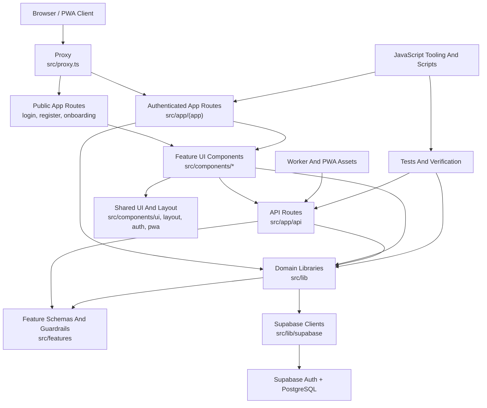

# Intended Architecture - TypeScript And JavaScript

This draft defines the top-level TypeScript and JavaScript components for Level Up Deen and the intended dependencies between them.

## Top-Level Components

### App Routes

**Path:** `src/app/**`

Next.js App Router entrypoints for public pages, authenticated app pages, layouts, loading/error boundaries, metadata, and API route handlers.

Responsibilities:
- Render public pages such as login, register, and onboarding.
- Render authenticated app pages under `src/app/(app)`.
- Enforce route-level authentication through layouts and proxy.
- Expose backend HTTP endpoints under `src/app/api`.

### Feature UI Components

**Path:** `src/components/{admin,ai-coach,avatar,dashboard,deen,finance,fitness,gamification,onboarding,planning,quests,settings,squad}/**`

Client and server React components for user-facing product features.

Responsibilities:
- Display feature workflows for daily quests, deen habits, fitness, water, finance, planning, squad, avatar, settings, and admin.
- Own local interaction state and form behavior.
- Call API routes or receive server-loaded data from app pages.

### Shared UI And Layout

**Path:** `src/components/{ui,layout,auth,pwa}/**`

Reusable presentation, navigation, authentication, and PWA shell components.

Responsibilities:
- Provide shared primitives such as buttons, cards, badges, progress bars, skeletons, and toasts.
- Provide app navigation and page transitions.
- Provide sign-out and PWA/service-worker registration behavior.

### Domain Libraries

**Path:** `src/lib/**`

Shared TypeScript domain, infrastructure, and utility modules.

Responsibilities:
- Centralize auth helpers, RBAC rules, routes, date handling, gamification, AI coach logic, finance parsing, personalization, PWA push helpers, and environment parsing.
- Provide Supabase browser/server clients through `src/lib/supabase`.
- Keep route strings and role definitions canonical.

### Feature Schemas And Guardrails

**Path:** `src/features/**`

Feature-specific validation, schema, and policy modules that should stay independent from UI rendering.

Responsibilities:
- Define onboarding validation schema.
- Define AI prompt guardrails and safety boundaries.

### Proxy

**Path:** `src/proxy.ts`

Request proxy for session refresh and route protection.

Responsibilities:
- Refresh Supabase Auth sessions.
- Redirect unauthenticated users away from protected app routes.
- Redirect authenticated users away from login/register.

### Worker And PWA Assets

**Path:** `worker/**`, `public/sw.js`, `public/worker-*.js`, `src/lib/pwa-push.ts`

TypeScript worker source plus generated JavaScript service-worker and push-notification assets.

Responsibilities:
- Keep installable PWA metadata and cleanup worker behavior.
- Handle push-subscription support through app APIs and Supabase persistence.

### JavaScript Tooling And Scripts

**Path:** `next.config.mjs`, `postcss.config.mjs`, `scripts/*.js`

Project configuration and Node.js automation scripts.

Responsibilities:
- Configure Next.js, PWA behavior, PostCSS, and build-time behavior.
- Provide smoke tests, workflow verification, and achievement checks.
- Stay independent from browser-only application code.

### Supabase Schema

**Path:** `supabase/migrations/**`

Database schema and migration history for persistence, authorization metadata, audit logs, push subscriptions, and feature data.

Responsibilities:
- Define canonical tables, constraints, audit logs, and schema evolution.
- Support Supabase Auth identities and user-owned application data.

### Tests And Verification

**Path:** `src/lib/__tests__/**`, `scripts/**`, `vitest.config.mts`

Automated checks and lightweight workflow verification.

Responsibilities:
- Validate auth and RBAC behavior.
- Verify expected workflow files and implementation markers.
- Provide project-level lint, typecheck, build, and test commands.

## Intended Relationships

## Dependency Rules

- `src/app/**` may depend on `src/components/**`, `src/lib/**`, and `src/features/**`.
- `src/components/**` may depend on `src/lib/**`, `src/features/**`, and shared UI components.
- `src/lib/**` must not depend on `src/app/**` or feature UI components.
- `src/features/**` must not depend on `src/app/**` or `src/components/**`.
- API routes must enforce server-side auth and ownership boundaries before reading or mutating user data.
- Admin routes and APIs must require the `admin_system` role through RBAC helpers.
- Supabase Auth is the canonical identity source; application roles are read from `users_profile.role`.
- Core workflow paths should use `src/lib/routes.ts` instead of repeated route strings.
- JavaScript files under `scripts/**` should be treated as project automation, not app runtime business logic.
- JavaScript files under `public/**` should not own security-sensitive logic or canonical application state.
- Generated design imports such as `stitch-assets/**` should stay out of the deployable source tree.
