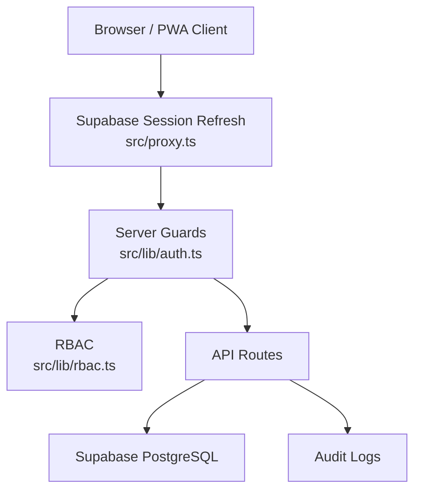

# Security - Level Up Deen

> Current security model for authentication, authorization, data protection, and operational safety.

## Security Architecture



## Authentication And Authorization

| Area | Implementation |
| --- | --- |
| Identity provider | Supabase Auth |
| Login/register | Email/password through Supabase client |
| Session refresh | `src/proxy.ts` with `@supabase/ssr` |
| Server auth helper | `src/lib/auth.ts` |
| App role source | `users_profile.role` |
| Admin role | `admin_system` |

Rules:

- Supabase Auth is the canonical identity source.
- API routes must call `getCurrentUserId()` or `requireAdminContext()` before database access.
- Admin routes and APIs must require `admin_system`.
- Normal users must never read or mutate another user's data.
- `AUTH_BYPASS_ENABLED` must never be enabled in production.

## Data Protection

- User-owned tables must include explicit ownership filters in server queries.
- Server-side APIs should validate request bodies with Zod.
- Service-role Supabase access is allowed only in server-side code.
- Audit-worthy changes should write to audit tables through `src/lib/audit.ts`.
- Secrets must stay in environment variables and must not be committed.

## PWA And Cache Safety

Production service-worker caching is disabled.

- `public/sw.js` is a cleanup worker.
- Workbox-generated files are ignored and should not be committed.
- Authenticated API/RSC responses must not be put into long-lived browser caches.

## Required Security Checks

Run before deploy:

```bash
npm run check
npm audit --audit-level=moderate
```

Current audit note: the available npm audit fix for Next.js advisories requires a breaking Next major upgrade, so that upgrade should be handled as a dedicated migration with browser regression testing.
