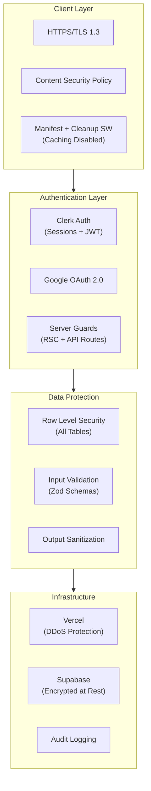

# Security — Level Up Deen

> Arsitektur keamanan, proteksi data, dan kebijakan keamanan Level Up Deen.

---

## 1. Security Architecture Overview



---

## 2. Authentication & Authorization

### 2.1 Authentication Methods

| Method | Implementation | Status |
|--------|---------------|--------|
| Email/Password | Clerk | MVP |
| Google OAuth | Clerk + Google | MVP |
| Magic Link | Clerk | Post-MVP |

### 2.2 Session Management

- Sessions are issued and refreshed by Clerk.
- `src/middleware.ts` runs Clerk session synchronization only.
- Server-side guards read Clerk request auth and verify Clerk `__session` cookies in `src/lib/auth.ts`.
- Role metadata is stored in Clerk public metadata.
- OAuth flows are handled by Clerk.

### 2.3 Server-Side Auth Guard

`middleware.ts` is intentionally limited to Clerk's Edge-safe session/handshake sync. Route protection is not enforced in middleware.

Current protection points:

```typescript
// src/lib/auth.ts
const verifiedToken = await verifyToken(sessionToken, {
  secretKey: serverEnv.CLERK_SECRET_KEY,
})

return verifiedToken.sub ?? null
```

- `src/app/(app)/layout.tsx` redirects unauthenticated users to `/login`.
- `src/app/(app)/layout.tsx` redirects incomplete profiles to `/onboarding`.
- API routes call `getCurrentUserId()` or `requireAdminContext()`.
- Admin access requires Clerk public metadata role `admin_system`.

### 2.4 Role-Based Access

| Role | Permissions |
|------|------------|
| **User** | Full CRUD on own data only |
| **Admin** | Manage master data (task templates, items, achievements, config). No access to personal user data except authorized support |

---

## 3. Data Protection

### 3.1 Row Level Security (RLS)

**Every user-facing table** has RLS enabled. Template:

```sql
-- Enable RLS
ALTER TABLE user_tasks ENABLE ROW LEVEL SECURITY;

-- Users can only read their own data
CREATE POLICY "user_read_own" ON user_tasks
    FOR SELECT USING (public.is_owner(user_id));

-- Users can only insert their own data
CREATE POLICY "user_insert_own" ON user_tasks
    FOR INSERT WITH CHECK (public.is_owner(user_id));

-- Users can only update their own data
CREATE POLICY "user_update_own" ON user_tasks
    FOR UPDATE USING (public.is_owner(user_id))
    WITH CHECK (public.is_owner(user_id));

-- Users can only delete their own deletable data
CREATE POLICY "user_delete_own" ON user_tasks
    FOR DELETE USING (public.is_owner(user_id) AND is_deletable = true);
```

### 3.2 RLS Coverage Matrix

| Table | SELECT | INSERT | UPDATE | DELETE | Notes |
|-------|--------|--------|--------|--------|-------|
| `users_profile` | own | own | own | own | CASCADE on auth delete |
| `user_stats` | own | own | own | — | System-managed |
| `user_tasks` | own | own | own | own + deletable | Mandatory tasks protected |
| `daily_task_logs` | own | own | — | — | Immutable after creation |
| `water_logs` | own | own | own | own | |
| `financial_transactions` | own | own | own | own | **Never exposed publicly** |
| `budgets` | own | own | own | own | |
| `savings_goals` | own | own | own | own | |
| `user_inventory` | own | own | own | — | |
| `user_achievements` | own | system | — | — | |
| `task_templates` | all | admin | admin | admin | Public read |
| `items` | all | admin | admin | admin | Public read |
| `achievements` | all | admin | admin | admin | Public read |

### 3.3 Financial Data Privacy

Financial data receives **enhanced protection**:

- Never exposed in any public-facing query
- Never included in leaderboard calculations
- Never sent to AI without aggregation (category-level only, no amounts)
- RLS enforced — no server bypass except authorized admin support
- Export restricted to data owner

### 3.4 Input Validation

All inputs validated with Zod at API boundary:

```typescript
// src/lib/validators/finance.ts
import { z } from 'zod'

export const transactionSchema = z.object({
  type: z.enum(['income', 'expense']),
  amount: z.number().positive().max(999_999_999),
  category_id: z.string().uuid(),
  description: z.string().max(500).optional(),
  transaction_date: z.string().date(),
})

export const budgetSchema = z.object({
  category_id: z.string().uuid(),
  amount: z.number().positive().max(999_999_999),
  month: z.number().min(1).max(12),
  year: z.number().min(2024).max(2030),
})
```

---

## 4. Infrastructure Security

### 4.1 Transport Security

| Layer | Protection |
|-------|-----------|
| Client ↔ Vercel | HTTPS/TLS 1.3 (enforced) |
| Vercel ↔ Supabase | HTTPS/TLS (Supabase enforced) |
| Supabase internal | Encrypted connections |

### 4.2 Data at Rest

| Storage | Encryption |
|---------|-----------|
| Supabase PostgreSQL | AES-256 at rest (Supabase managed) |
| Supabase Storage | Encrypted (Supabase managed) |
| Client cache/offline queue | PWA caching disabled; future offline queue must avoid sensitive data |
| Vercel Edge | No persistent storage |

### 4.3 Secret Management

| Secret | Storage | Access |
|--------|---------|--------|
| `CLERK_SECRET_KEY` | Vercel env vars | Server-only auth/admin operations |
| `SUPABASE_SERVICE_ROLE_KEY` | Vercel env vars | Server-only database mutations |
| `GOOGLE_CLIENT_SECRET` | Vercel env vars | Server-only |
| `GEMINI_API_KEY` | Vercel env vars | Optional server-only AI features |
| `NEXT_PUBLIC_SUPABASE_ANON_KEY` | Vercel env vars | Public (safe — RLS enforced) |
| `NEXT_PUBLIC_CLERK_PUBLISHABLE_KEY` | Vercel env vars | Public Clerk browser key |

**Rules:**
- Never commit secrets to git
- Use `.env.local` for local dev (in `.gitignore`)
- Rotate service role keys periodically
- `NEXT_PUBLIC_*` vars are browser-exposed — only public keys

### 4.4 Content Security Policy

```typescript
// next.config.mjs
const securityHeaders = [
  {
    key: 'Content-Security-Policy',
    value: [
      "default-src 'self'",
      "script-src 'self' 'unsafe-eval' 'unsafe-inline'", // Next.js requires
      "style-src 'self' 'unsafe-inline'",
      `connect-src 'self' ${process.env.NEXT_PUBLIC_SUPABASE_URL} https://*.supabase.co`,
      "img-src 'self' data: blob: https://*.supabase.co",
      "font-src 'self' https://fonts.gstatic.com",
    ].join('; ')
  },
  { key: 'X-Frame-Options', value: 'DENY' },
  { key: 'X-Content-Type-Options', value: 'nosniff' },
  { key: 'Referrer-Policy', value: 'strict-origin-when-cross-origin' },
  { key: 'Permissions-Policy', value: 'camera=(), microphone=(), geolocation=()' },
]
```

---

## 5. Audit Logging

### 5.1 Events to Log

| Category | Events |
|----------|--------|
| **Auth** | login, logout, register, password_change, account_delete |
| **Finance** | transaction_create, transaction_update, transaction_delete |
| **Gamification** | item_purchase, level_up, rank_up |
| **Data** | data_export, settings_change |
| **AI** | ai_chat (metadata only), ai_recommendation_response |
| **Sync** | sync_completed, sync_conflict, sync_failed |

### 5.2 Log Schema

```sql
CREATE TABLE audit_logs (
    id UUID PRIMARY KEY DEFAULT gen_random_uuid(),
    user_id text REFERENCES public.users_profile(id) ON DELETE SET NULL,
    event_type VARCHAR(50) NOT NULL,
    event_data JSONB DEFAULT '{}',
    ip_address INET,
    user_agent TEXT,
    created_at TIMESTAMPTZ DEFAULT NOW()
);

CREATE INDEX idx_audit_user_event ON audit_logs(user_id, event_type);
CREATE INDEX idx_audit_created ON audit_logs(created_at);
```

---

## 6. Threat Model

| Threat | Impact | Mitigation |
|--------|--------|-----------|
| Unauthorized data access | High | RLS on all tables, JWT auth |
| SQL injection | High | Parameterized queries (Supabase client), Zod validation |
| XSS | Medium | React auto-escaping, CSP headers |
| CSRF | Medium | Same-site cookies, Server Actions (built-in CSRF) |
| Brute force login | Medium | Supabase rate limiting, account lockout |
| Data exfiltration | High | RLS, no bulk export API, audit logging |
| Offline data theft | Low | PWA caching disabled; future offline data must be minimal |
| AI prompt injection | Medium | Input sanitization, output validation, Islamic guardrails |
| DDoS | Medium | Vercel DDoS protection, Supabase rate limits |

---

## 7. Security Checklist (Per Release)

- [ ] No hardcoded secrets in codebase
- [ ] RLS policies for all new tables verified
- [ ] Zod validation on all new API inputs
- [ ] Server-side guards cover new protected routes and APIs
- [ ] Financial data not exposed in new features
- [ ] Audit logging for new sensitive operations
- [ ] CSP headers updated if new external sources added
- [ ] Dependencies scanned for vulnerabilities (`npm audit`)
- [ ] Service role key not used in client-side code
